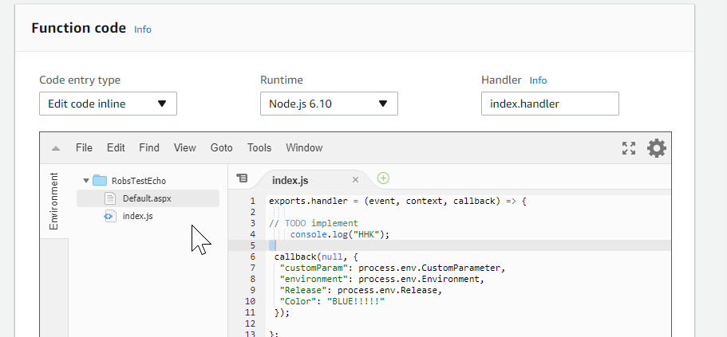
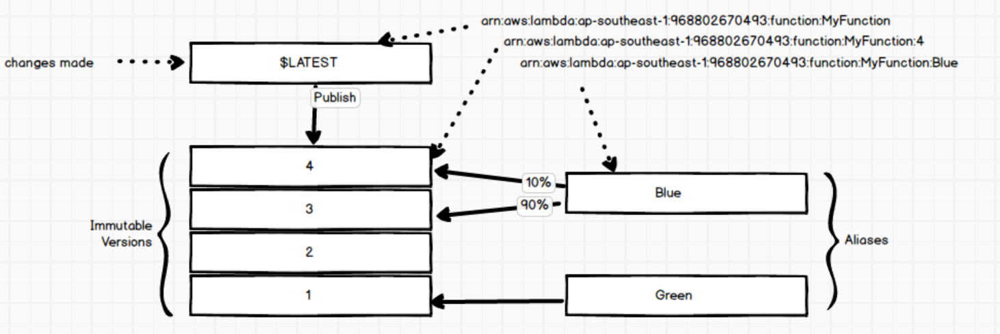
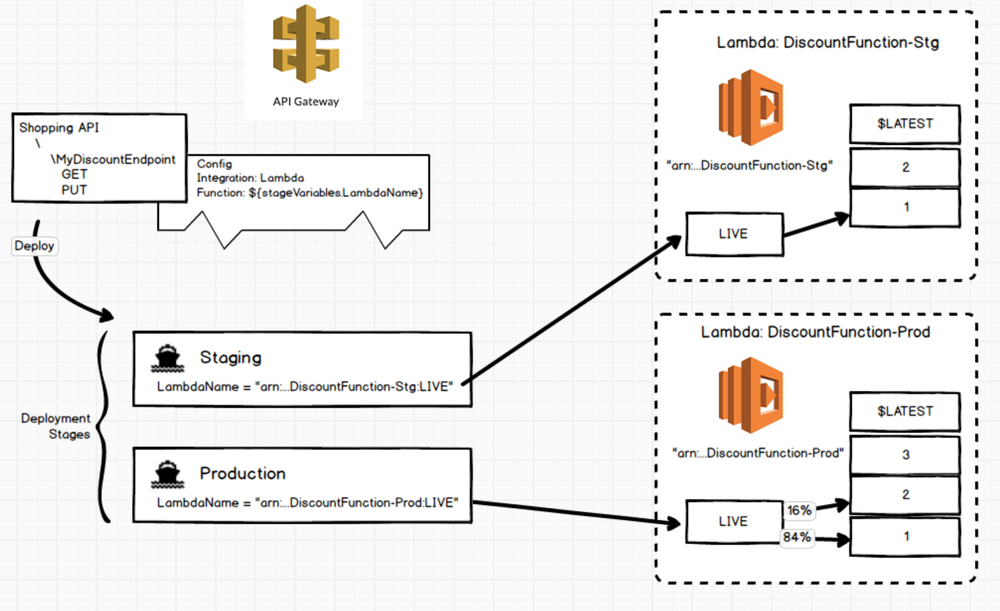
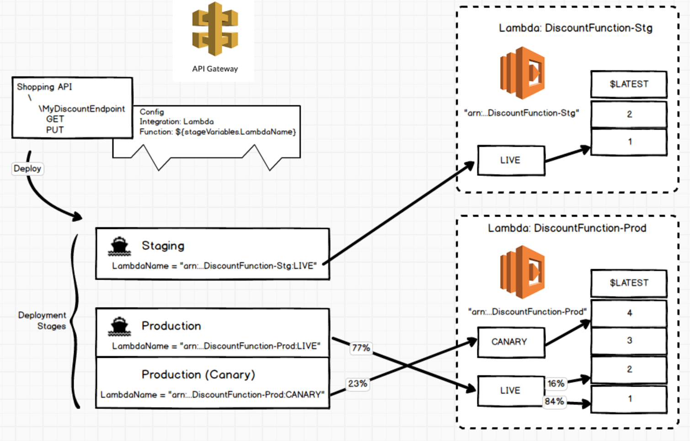
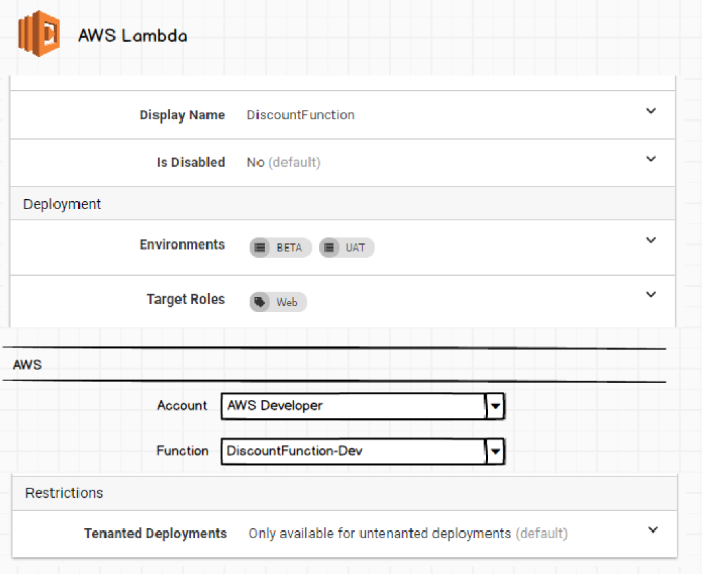
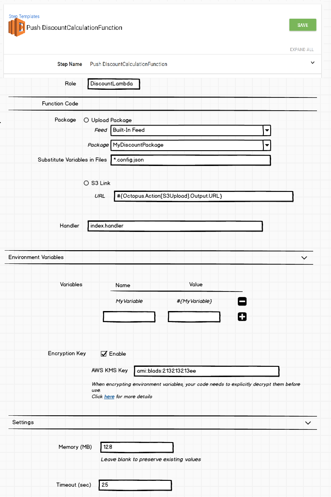
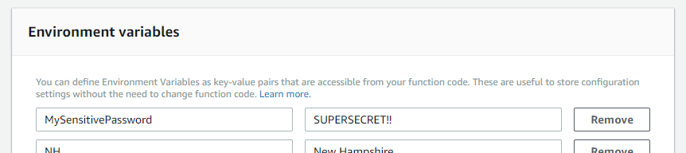
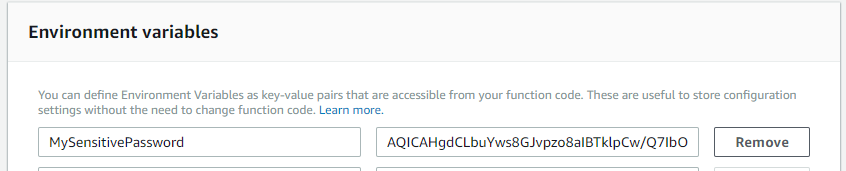
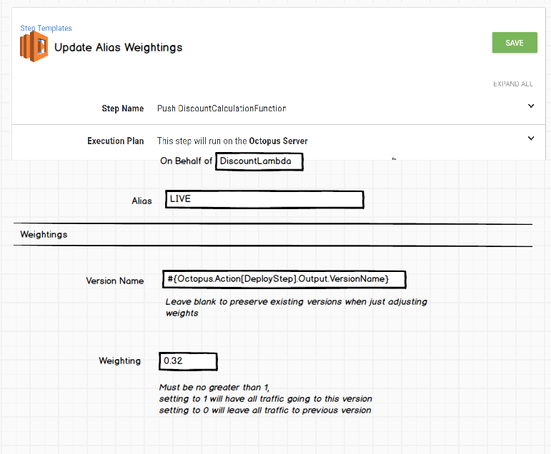

# AWS Lambda Step
Similar to Azure Functions, AWS Lambdas allow you to host a service that exposes a single endpoint, typically performing a single specific task. A Lambda is configured with a package, either provided directly via a zip package, sourced from a zip contained in S3, or (for some languages) typed directly in the AWS Lambda web portal.



The `Handler` property defines the entry point for your code when it is executed and different runtimes will require differently formatted handlers. Node.js would resolve `index.handler` to `index.js` whereas .net core requires a handler that resolves to a fully qualified `assembly::namespace.class-name::method-name` location. While scripting languages like Node and Python can be provided in their raw state, languages like .net need to be compiled. Any functions that require non-standard library dependencies need to have them packaged within the zip. Lambdas don't do any pre `npm install`, `dotnet restore` etc so everything needs to be included ready to go so some pre-build process may still be required.

On their own, lambdas are just small units of code execution that dont necessarily have any external use until connected up to some sort of triggering mechanism. For many typical scenarios, that may be by making it the target of an AWS API Gateway endpoint to open it up to HTTP traffic, or it may be fired off by users when they perform some other AWS action, like S3 uploads or SNS messaging.

### Versions & Aliases
When updating a Lambda, all the changes take place to the `$Latest` version. Similar to git where changes take place to `HEAD` until a commit takes place and that immutable commit is added to the record. In Lambda when the user is happy with their changes they can **Publish a new version** which then creates an immutable copy of the entire function state at that point in time and which then be addressed as the specific version of the function to invoke (again think of commit hashes).

To allow for externally addressing a static lambda which can still be updated, the **Alias** concept can be utilized.
An alias is an addressable pointer to version which can be changed while preserving the alias address (think git tags). Additionally an alias can have a second version that can be configured with a weighting value to distribute traffic between the two versions.



### Other Properties
Various other properties are available for configuration on a Lambda that may make sense to change between versions. These properties cover settings like Environment variables (key/value properties that must confirm to specific naming rules), VPC, memory and timeout, execution role and error handing. Some (or all) of these may make sense to expose through the Octopus step.

## Common Deployment: API Gateway
While not all deployments to an AWS Lambda will be made with the expectation to expose them to the world directly via HTTP traffic, this is expected to be a common scenario so it makes sense to have an understanding how these two would typically fit together.

API Gateway allows you to configure a set of resources (or endpoints) with different execution flows for the various HTTP verbs. An AWS Lambda can serve as the target for one of these resources. When configuring a resource, to make it "live", the user deploys that resource to a `Stage`, each of which gets a different root URL. Each stage can contribute variables (amongst other settings) that can be used to dynamically configure the underlying resource. These stage variables can even be used to define the specific Lambda that is invoked by contributing the ARN address that points to a version or alias as described above.



These stages can themselves be configured to support [Canary deployments](https://aws.amazon.com/blogs/compute/implementing-canary-deployments-of-aws-lambda-functions-with-alias-traffic-shifting/). With this feature enabled a deployment to a stage first goes into a canary phase of that stage. Traffic is then distributed between the previously deployed version of that resource and the just-deployed canary phase. A new deployment of the resource will the overwrite the Canary until the canary phase is "promoted" to being the primary version.



For the purposes of this spec, we will assume that the API Gateway is managed outside Octopus (or through custom AWS PS scripting steps) and we will focus on Lambda, ensuring that the above model still fits.

## New Octopus Steps
### Lambda Target Type
In keeping with the new approach the lambda steps will require a new Target that provides details relating to a specific Lambda function.



In the typical (and prescribed) scenario, the user would be expected to have a different Lambda for each environment.

### Push To Lambda Step
The main step is one that will deploy a "package" to an AWS Lambda. We _could_ create a step that also creates the lambda if it doesn't exist, but at the moment we will focus on the assumption that one already exists, since there will currently be no configuration options for actually connecting triggers up to them (in which case the newly created lambda would be otherwise pointless), and it is assumed that the target used on this deployment will need to have been pre-defined. Creating Lambdas can be handled by cloud-formation steps and/or environment templates.

At the end of the step, the changes will be "published" as a new version with that version value passed into an output variable so that it can be referenced and used in later steps like configuring an alias or other custom scripts.

#### Function Code
In the case of Octopus we will ignore the scenario of providing code directly through the UI. The UI provided through the AWS portal is a whole mini IDE allowing the creation of sub-files, folders, code-completion and intellisense... not something we want to get involved with.

For the package source we can allow the user to couple it with a previous S3 step, particularly if the user has one package that is used by multiple functions.

Alternatively the user could opt to include it from a package within this step, where it will be acquired and uploaded as part of the step itself. If this option is taken, then it might be possible to crack open the package, perform variable replacement and bundle it back up before pushing.



#### Variables
Although AWS encrypts variables in at-rest, they are available in cleartext through the API or portal if not encrypted in transit.



The portal includes a helper tool to encrypt the variables using AWS KMS keys which can then be programmatically decrypted inside the user's code without explicitly passing the key (so long as the Execution role has access to that key used to decrypt it).

To programaticaly encrypt the variables when using the API, a separate AWS call needs to take place for each value, using a key that is available to both the execution role of the lambda, and the profile user of the API.

```powershell
$sensitiveValue = "SUPERSECRET"
$EncryptedOuput = (Invoke-KMSEncrypt -KeyId $keyID -Plaintext $(ConvertFrom-StringToMemoryStream $sensitiveValue))
$encryptedValue = ConvertFrom-StreamToBase64 $EncryptedOuput.CiphertextBlob
...
Update-LMFunctionConfiguration -Environment_Variable @{"MySensitivePassword"= $encryptedValue;} ...
```

The variable will then be encrypted with a value which then needs to be decrypted by the user within their code before use. 



As an example decrypting this value using the nodejs runtime:

```javascript
const AWS = require('aws-sdk');
const kms = new AWS.KMS();
const data = {
    CiphertextBlob: new Buffer(process.env.SUPERSECRET, 'base64')
    };
 kms.decrypt(data, (err, data) => {
   if (err) console.log(err, err.stack); // an error occurred
   else     console.log(data.Plaintext.toString('utf8'));
 });
```

_NOTE: It appears a _better_ solution is to instead to use the `New-KMSDataKey` cmdlet to retrieve a key that can be used to encrypt all variables locally rather than performing requests for each variable. This requires _also_ passing the generated encrypted data key into their function which is used in the lambda to decrypt the variables (with itself being decrypted by the KMS key available to the execution role!)_

### Update Alias and Weightings
When using Lambdas a common pattern is to reference a static `Alias` which in turn points to a changing version, similar to how a `tag` in git could be changed to point to any particular commit. These Aliases also provide a mechanism to perform canary upgrades, allowing a distribution of traffic across two different versions. A typical scenario through Octopus might therefore be

1. Alias `Live` is currently set up on a Lambda pointing all traffic to version `1.0`.
2. Octopus deployment updates lambda with new package for version `1.1`
    * This publishes a new version as part of the process.
    * The published version is put into an output variable
3. Alias `Live` is updated to point 20% of traffic to `1.1` using the previous output variable denoting the new published version.
4. User runs automated tests and/or manual verification
5. Upon success alias `Live` is updated to point 100% of traffic to `1.1`

With the introduction of maintenance tasks, its possible that some other triggers may, at a later point want to again update the alias so that 100% of the traffic goes back to `1.0` due to some failures. This could be done without having to know the specifics about what the previous version actually was since all that would be involved would be converting the "current" primary version to 0%.

As noted above, the AWS API Gateway has its own additional canary process (and one which we may expose in some future steps), this is certainly not the only way lambdas as used and as such, it makes sense to provide a mechanism to configure traffic distribution through the lambda-native approach.

