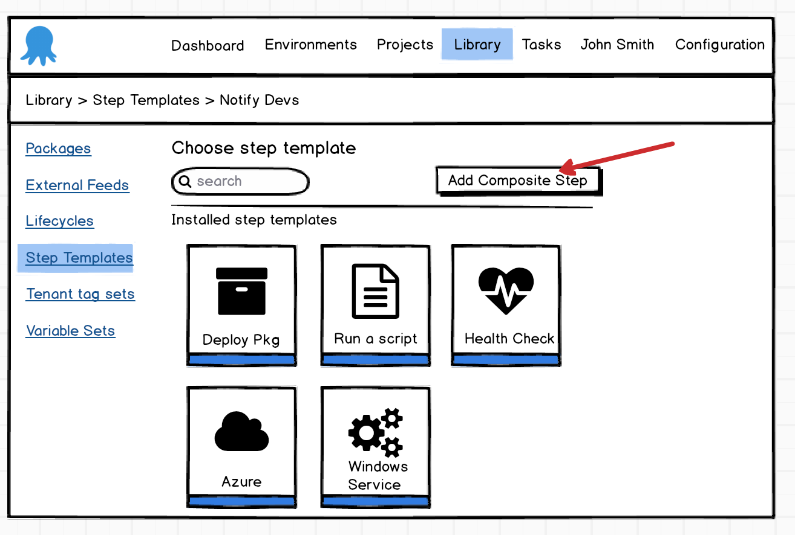
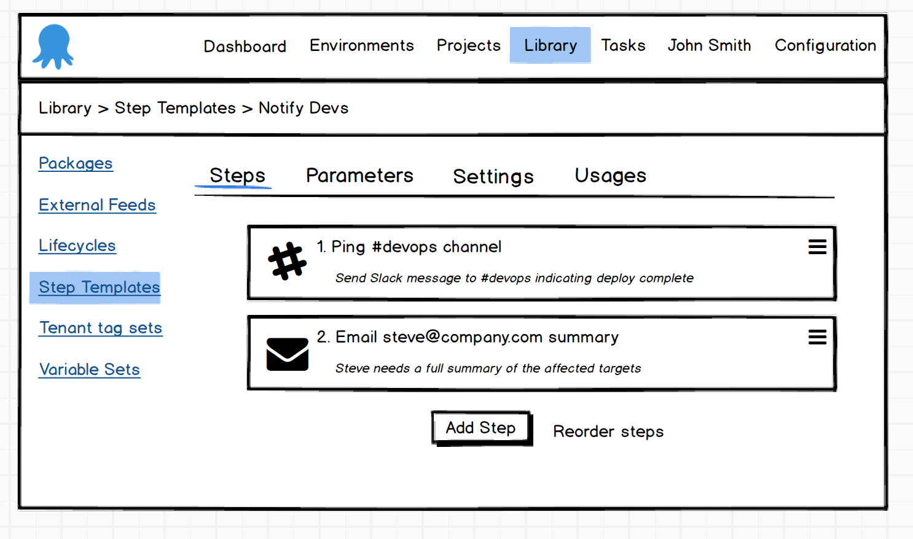
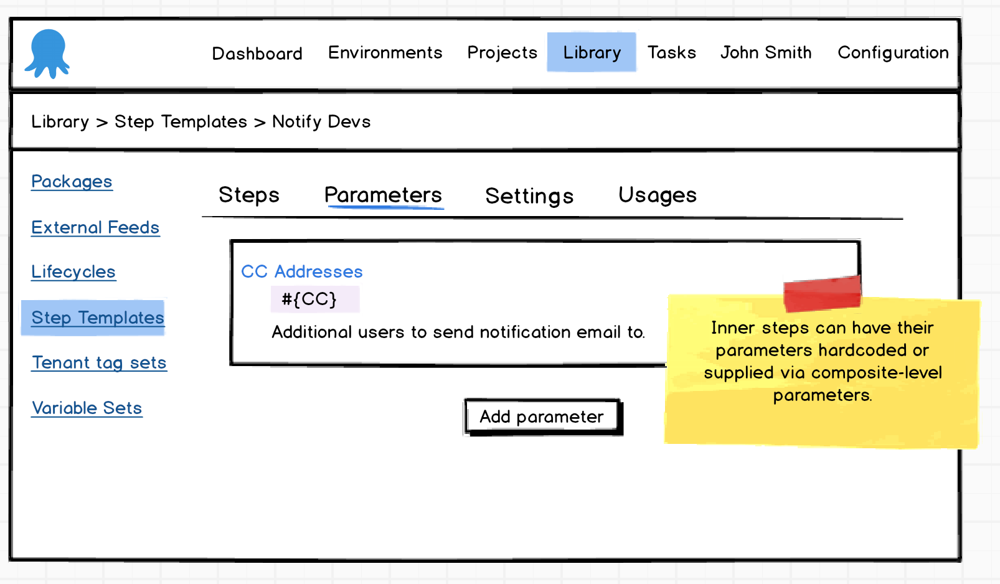
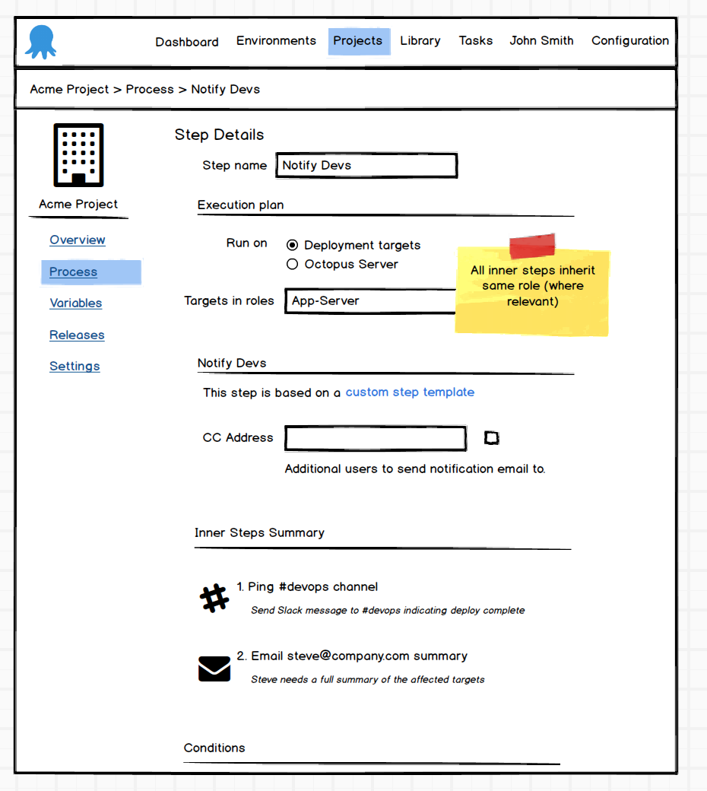
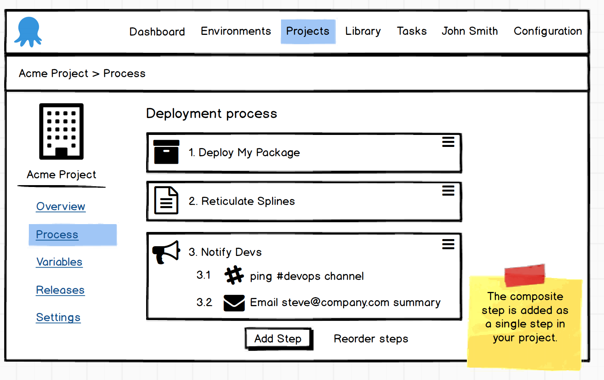

# Composite Step Templates #

## User Requests ##
[UserVoice #12948603 - Composite Step Templates (686 votes)](https://octopusdeploy.uservoice.com/forums/170787-general/suggestions/12948603-composite-step-templates)

[UserVoice #6559846- Inheritable Step Templates (179 votes)](https://octopusdeploy.uservoice.com/forums/170787-general/suggestions/6559846-inheritable-templates)

[UserVoice #6939372 - Blue/Green Deployments (145 votes)](https://octopusdeploy.uservoice.com/forums/170787-general/suggestions/6939372-make-the-blue-green-model-the-gold-standard-of-dep)

[UserVoice #6512944 - Blue/Green Deployments (6 votes)](https://octopusdeploy.uservoice.com/forums/170787-general/suggestions/6512944-what-happened-to-blue-green-deployment)

## Design ##
#### Set Up ####
A user should be able to create a composite step template in a similar manner to existing "single" step templates with the difference that rather than adding a single script, a set of other steps are added creating its own process.

A composite step template would still be able to provide parameters just like any other standard step template. These parameters will be made available to all of its constituent steps.

#### Usage ####
When a composite step template is added to a project, the template parameter values can be supplied in a way similar to existing templates. The steps can be targeted to specific roles (where appropriate) and the same sort of execution conditions can be applied.

When a composite step template is added to a project, it is treated as a single atomic self contained "block" of steps.

Since a composite step exists as a single atomic unit, any changes made to the original template are able to propagate down to the projects in the same way that standard step templates work.

If however a user wants to customize the composite step and rearrange/edit/remove steps or even inject their own "project steps" then they can opt to "unlink" the composite step at which point it becomes converted to a set of normal steps as if the user had created it themselves. With this done, no updates would flow down from the original template (unless the inner steps are templates themselves).

### Nested Steps - It's turtles all the way down
Although a composite step template can contain a rolling step, it cannot be made of composite steps that themselves are rolling, nor be a member of a rolling step on the parent project. This is to ensure it does not result in strange configurations. What does it mean to loop on behalf of `Role-X` _and_ `Role-Y`?

### Role Type
To allow users to design flexible templates that can be used in projects where the role cannot be defined statically in the single template, a parameter of type `Role` should be available. When consuming that template the input field takes the shape of the standard role picker. Internally, the inner steps that need roles can then bind to that parameter. To prevent errors, it is imagined that rather than the standard "cleartext" binding that allows typing any value, it would probably be displayed as a drop down of the available role-parameter types.
