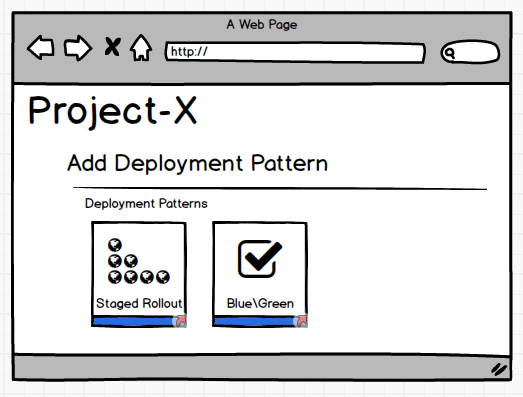
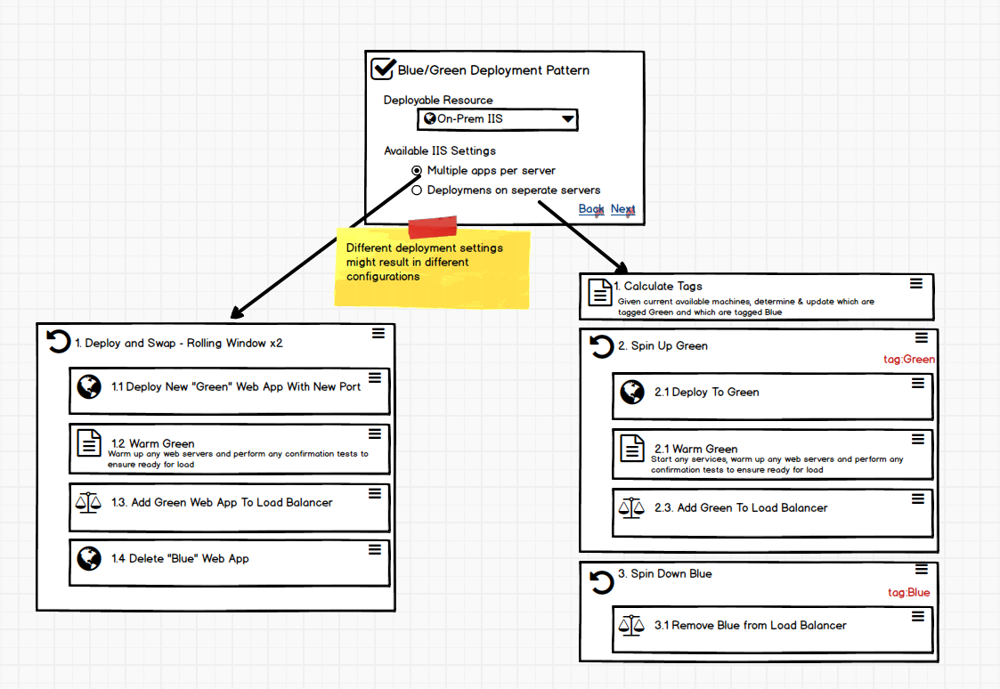
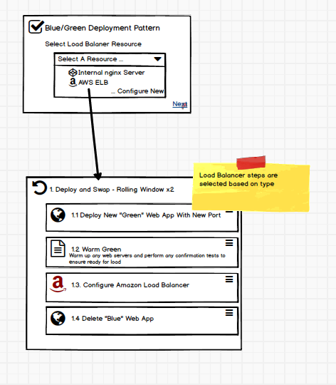
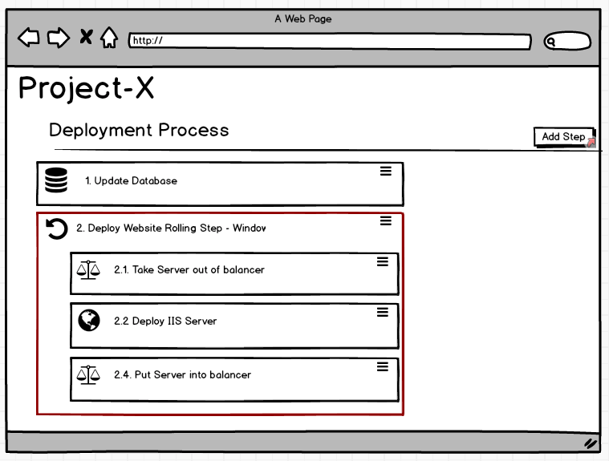
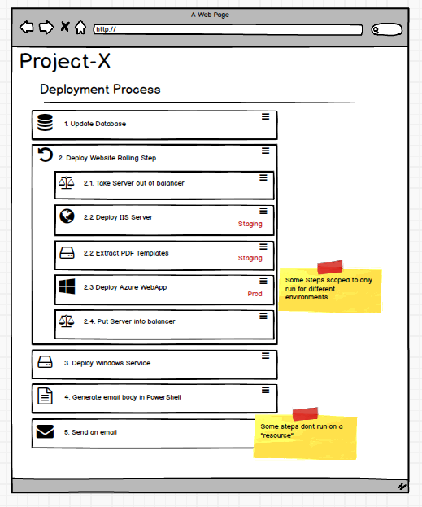

# Compositte Step Templates #

## User Requests ##
[UserVoice #12948603 - Composite Step Templates (686 votes)](https://octopusdeploy.uservoice.com/forums/170787-general/suggestions/12948603-composite-step-templates)

[UserVoice #6559846- Inheritable Step Templates (179 votes)](https://octopusdeploy.uservoice.com/forums/170787-general/suggestions/6559846-inheritable-templates)

[UserVoice #6939372 - Blue/Green Deployments (145 votes)](https://octopusdeploy.uservoice.com/forums/170787-general/suggestions/6939372-make-the-blue-green-model-the-gold-standard-of-dep)

[UserVoice #6512944 - Blue/Green Deployments (6 votes)](https://octopusdeploy.uservoice.com/forums/170787-general/suggestions/6512944-what-happened-to-blue-green-deployment)

## Design ##

### Deployment Patterns ###
Common deployment patterns could be interpreted as built-in composite step templates with a bit of a wizard to fill in some of the key step types.
Although the following depicts mockups using resources, which may or may not be available at the time of this work, it serves as an example. As such, feel free to ignore some of the finer details.

The user us provided with a set of deployment patterns when adding a new step.

In this blue/green deployment scenario the user has specified that the deployment resource is an IIS web server. From this selection then, there are two different ways they may want to handle running multiple instances of this website. Either by running the same bindings across multiple targets, or buy using one machine but just exposing the blue and green website, say with different ports. In the first case the determination of which machine is blue and which is green needs to take place outside of the deployment window, but not when it is shared on a single machine.

In the next step of the wizard the user has to select which resource will play the role of load balancer in this deployment. Depending on which load balancer they select, e.g. NGinX, Azure etc, then different step types will be utilized during the load balancer phases.

At the end the selected options determine a bunch of steps that are added to the project.

At this point the steps are treated like any other composite step template and the steps can be modified as desired.

_Mockups available in [CompositeStepTemplates.bmpr](./CompositeStepTemplates.bmpr)_