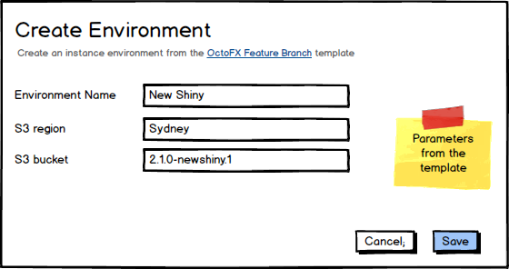

_Environments as Cattle, not Pets_

Rather than having a static set of Environments, it is sometimes desirable to have dynamic Environments which created and disposed frequently.  

Example scenarios may be:

- Feature Branches
- Environment-per-tester

# Environment Templates

We will allow creation of Environment Templates.

## Elevator Pitch

Today users may do something like the following to create on-demand environments:

1. Create an Environment.  e.g. `POST /api/environments` 
2. Deploy an 'Infrastructure Provisioning' project which, for example, executes a Cloud Formation template to provision infrastructure. 
3. Create any necessary environment-scoped variables, accounts, certificates, etc for the new environment.

Environment Templates will combine steps 1 and 2 (also avoiding the need for a separate infrastructure project) and allow step 3 to be performed _once for the entire class of environments_ rather than once per environment created.


## Provisioning Processes 

An Environment Template will allow optional provisioning and de-provisioning processes.

### Parameters

If the provisioning process requires input parameters, these can be added to the Environment template.  This are essentially the same as parameters to Step Templates.

The parameters will be available as variables to the provisioning process.

Note: If [automatic provisioning](@automatically-provision-de-provision) is configured, then all parameters will require a default value.

### Capturing Results of Provisioning

Results from the provisioning process need to be captured and reflected in the newly created Octopus Environment. 

These may include:

- Variables 
- Targets
- Accounts
- Certificates

For example, the provisioning process may execute a CloudFormation template which creates a Linux server in EC2.  We need to create an SSH account and an SSH target in the Octopus Environment. 

We will provide a number of ways to achieve this (possibly not all initially):

#### Promoted Output Variables

We will add some special-sauce to output variables to allow [promoting them to an explicit scope](promoted-output-variables.md). In this case the only scopes that would apply are `Environment` (and possibly `Target`).

#### Functions

Similar to the way [output variables](https://octopus.com/docs/deployment-process/variables/output-variables) are captured today, we will provide functions to capture the results of the provisioning process. 

Capturing an SSH KeyPair would look something like:

```
New-OctopusAccount -Name "Roger Ramjet SSH" -Type SshKeyPair -PrivateKeyFile "#{Octopus.Action[Provision AWS].Output.PrivateKeyFile}" -Password "#{Octopus.Action[Provision AWS].Output.SshPassword}"

New-OctopusTarget -Name "Roger Ramjet Ubuntu" -Type Ssh -Host "#{Octopus.Action[Provision AWS].Output.SshHost}" -Port 22 -Account "Roger Ramjet SSH" -Fingerprint "#{Octopus.Action[Provision AWS].Output.SshFingerprint}" 
```

#### Octopus Environment Templates

The functions approach above is flexible, but perhaps not the most natural way to capture results if you are provisioning your environment using, for example, a CloudFormation or ARM template.

For these scenarios will create an Octopus Environment Template DSL, allowing declarative modelling of how the newly provisioned environment should look.

Capturing the SSK KeyPair account and target from the Functions approach above might look something like:

```
{
    "accounts": [
        {
            "type": "SSHKeyPair",
            "name": "Roger Ramjet SSH",
            "privateKeyFile": "#{Octopus.Action[Provision AWS].Output.PrivateKeyFile}",
            "password": "#{Octopus.Action[Provision AWS].Output.SshPassword}" 
        }
    ],

    "targets": [
        {
            "type": "SSH",
            "name": "Roger Ramjet Ubuntu",
            "roles": ["web-server"],
            "host": "#{Octopus.Action[Provision AWS].Output.SshHost}",
            "port": 22,
            "account": "Roger Ramjet SSH",
            "fingerprint": "#{Octopus.Action[Provision AWS].Output.SshFingerprint}"
        }
    ],

    "variables": [
        {
            "name": "Foo",
            "value": "#{Octopus.Action[Provision AWS].Output.Foo}"
        }
    ]
}
```

#### Octopus Environment Process Step 

As a final option, we could provide a new step type which would provide a UI representation of the template above. 

## Automatically Provision\De-Provision

An Environment Template can be configured to automatically provision an Environment when a Lifecycle Phase is reached which contains the Template (see the _Triggers_ section in the image above).

The name of the provisioned Environment should be a variable expression.  The expression will be evaluated against the Release which triggered the provisioning. 

If a subsequent Release triggers provisioning and matches the name of an existing Environment, the Template can be configured to re-provision (de-provision the existing, and provision the new). Alternatively, the existing Environment will remain and provisioning will be skipped.

De-provisioning can also be automatically triggered.  Triggering events for de-provisioning are:

- A Release progresses to the next phase of a Lifecycle.   

- Days since last deployed 

## Manually Provision/De-Provision

Instance Environments can be manually created from a Template.



Deleting an Environment which was provisioned from a Template will run the de-provisioning process (we may want to add a confirmation, to allow _not_ de-provisioning).

## Lifecycles 

Environment Templates can appear in Lifecycles Phases.  


When adding an Environment Template to a Lifecycle Phase, it can be configured so that instances of the Template are either manually or automatically deployed, just as with regular Environments. 


### Required to Progress

Environments created from Environments Template (whether automatically, manually, or from external to Octopus) will be considered in the Lifecycle Phase Progression rules just as any other Environment. 

For example, if an Environment Template has been added to a Phase which is configured as _All must complete_, then if there are any Environments which were created from the Template they must have all been deployed to. 

## Scoping

Environment Templates can be used as a Scope everywhere an Environment can. This includes:

- Variables
- Permissions
- Accounts
- Certificates
- Tenants (see [tenants](#Tenants) section below).

The exception is Machines. It doesn't make sense to scope a machine to an Environment Template.

## Project Variables

Project Variables can be scoped to Environment Templates. These variables will apply to any instances of the Template.   
The rank of these variables will be less than variables scoped directly to the Environment. 

## Tenants

There are two options for linking tenants to templated environments.

### Link to the Template

Tenants can be linked to an Project\Environment-Template combination, and Tenant-variables can also be defined for the Environment Template. 
The tenanted-project can then be deployed to any instance environment created from the template (assuming the Lifecycle allows it).

### Link directly to the instantiated Environment

If one wants to be more explicit, rather than linking Templates to the Environment Template you can create an instance environment of a Template and explicitly configure the linkages to it for all desired tenants and environments (either via the UI or the API).  

## API

Environment Templates will be a resource with `GET`, `POST`, `PUT`, and `DELETE` actions (just like every other resource) :

```
/api/environmenttemplates
```

There will be a custom endpoint to create an instance of a Template.  e.g.

```
POST /api/environmenttemplates/{{TemplateId}}/instances
```

Retrieving all instances of a Template could possibly be done via the templates endpoint:

```
GET /api/environmenttemplates/{{TemplateId}}/instances
```

or via the environments endpoint:

```
GET /api/environments?template={{TemplateId}}
```

Instances templates can be treated via the API as any other Environment.  For example the response from 

```
GET /api/environments
```

would include any environments created via a template. 


# Scenarios

- [Feature Branch Environments](scenario-feature-branch.md)