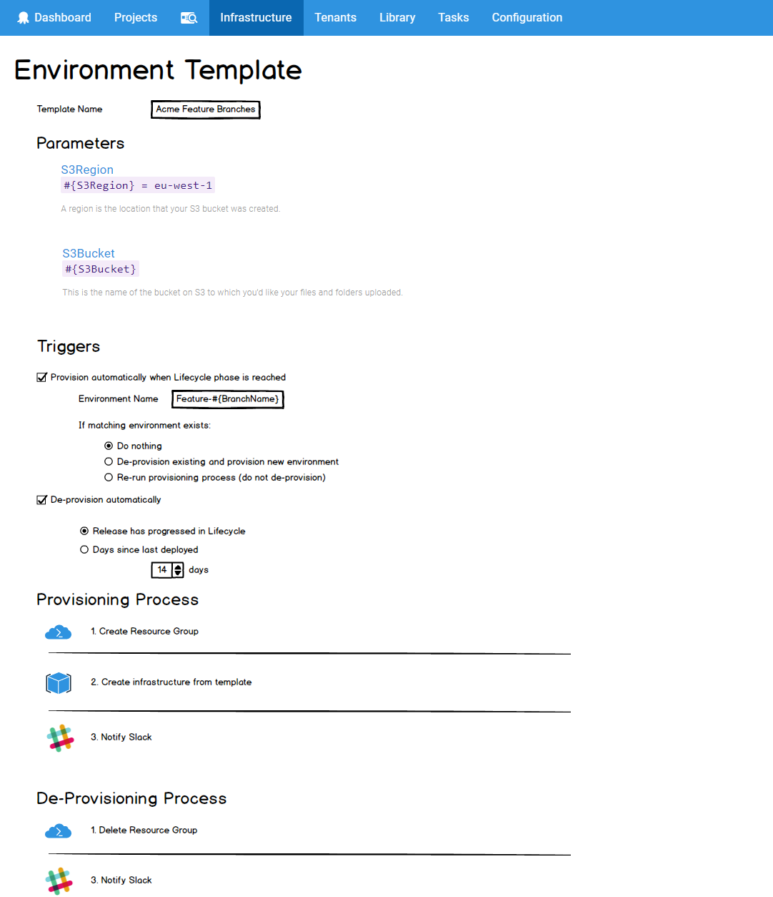

_Environments as Cattle, not Pets_

Rather than having a static set of Environments, it is sometimes desirable to have dynamic Environments which created and disposed frequently.  

Example scenarios may be:

- Feature Branches
- Environment-per-tester
- Immutable Infrastructure

# Environment Templates

We will allow creation of Environment Templates.



## Provisioning Processes 

An Environment Template will allow optional provisioning and de-provisioning processes.

## Automatically Provison\De-Provision

An Environment Template can be configured to automatically provision an Environment when a Lifecycle Phase is reached which contains the Template (see the _Triggers_ section in the image above).

The name of the provisioned Environment should be a variable expression.  The expression will be evaluated against the Release which triggered the provisioning. 

If a subsequent Release triggers provisioning and matches the name of an existing Environment, the Template can be configured to re-provision (de-provision the existing, and provision the new). Alternatively, the existing Environment will remain and provisioning will be skipped.

De-provisioning can also be automatically triggered.  Triggering events for de-provisioning are:

- A Release progresses to the next phase of a Lifecycle.   

- Days since last deployed 

## Lifecycles 

Environment Templates can appear in Lifecycles Phases.  


When adding an Environment Template to a Lifecycle Phase, it can be configured so that instances of the Template are either manually or automatically deployed, just as with regular Environments. 


### Required to Progress

Environments created from Environments Template (whether automatically, manually, or from external to Octopus) will be considered in the Lifecycle Phase Progression rules just as any other Environment. 

For example, if an Environment Template has been added to a Phase which is configured as _All must complete_, then if there are any Environments which were created from the Template they must have all been deployed to. 

## Scoping

Environment Templates can be used as a Scope everywhere an Environment can. This includes:

- Variables
- Permissions
- Accounts
- Certificates

The exception is Machines. It doesn't make sense to scope a machine to an Environment Template.

### Variables

Project Variables can be scoped to Environment Templates. These variables will apply to any instances of the Template.   
The rank of these variables will be less than variables scoped directly to the Environment. 

### Tenants

Tenants can be linked to an Project\Environment-Template combination.

## API

Environment Templates will be a resource with `GET`, `POST`, `PUT`, and `DELETE` actions (just like every other resource) :

```
/api/environmenttemplates
```

There will be a custom endpoint to create an instance of a Template.  e.g.

```
POST /api/environmenttemplates/{{TemplateId}}/instances
```

Retrieving all instances of a Template could possibly be done via the templates endpoint:

```
GET /api/environmenttemplates/{{TemplateId}}/instances
```

or via the environments endpoint:

```
GET /api/environments?template={{TemplateId}}
```

Instances templates can be treated via the API as any other Environment.  For example the response from 

```
GET /api/environments
```

would include any environments created via a template. 


# Scenarios

- [Feature Branch Environments](scenario-feature-branch.md)