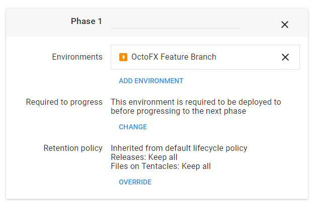

## Feature Branch Environments

> Everytime we build the OctoFX project from a feature-branch, we want to automatically provision an Environment and deploy to it.

Configure TeamCity to build and push packages from feature-branches with a version like `OctoFX.2.0.0-NewShiny.1`.  
TeamCity will also create the Octopus Release, and will supply the `Branch` variable when creating the Release. 

Create an Environment Template as shown below: 

Create a _Feature Branch_ Lifecycle with single phase containing the OctoFX Feature Branch Environment Template, set to auto-deploy.

Create a _Feature Branch_ channel in the OctoFX project, which will be used when OctoFX pacakage matches the version rule, and is configured to use the _Feature Branch Lifecycle_. 