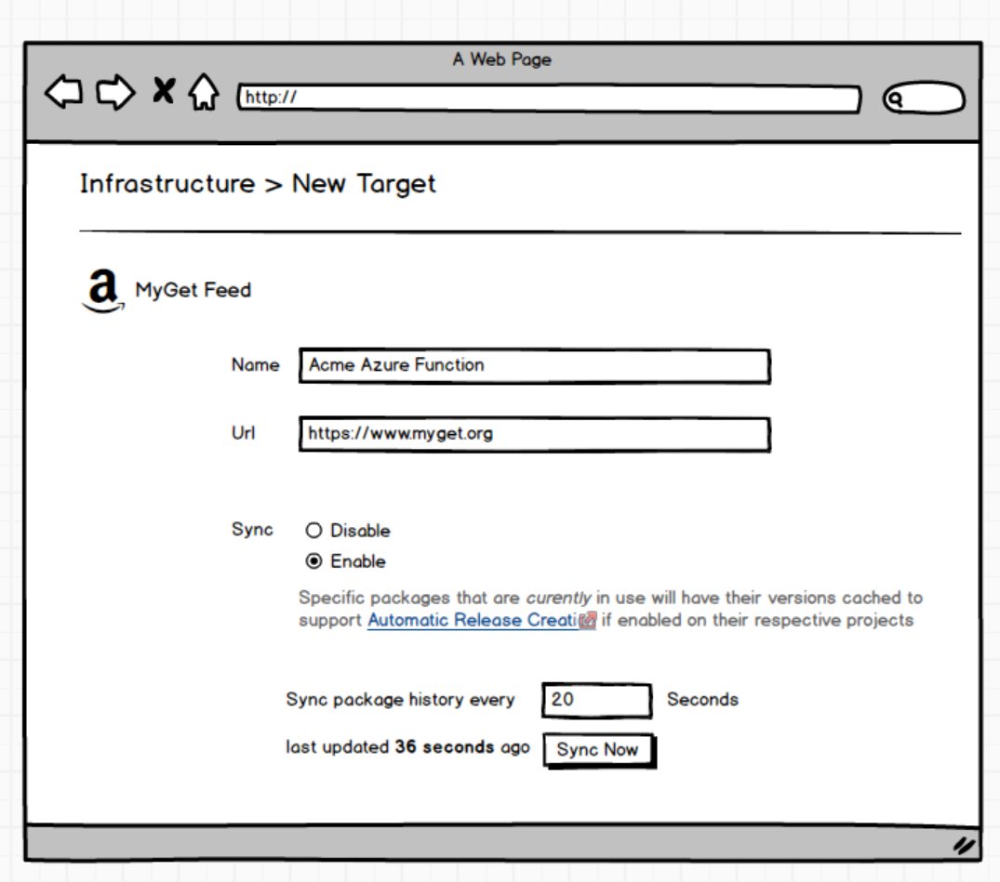

# Automatic Release Creation for External Feeds

To support Automatic Release Creation for external feeds Octopus needs to know about new package versions that are pushed. While some feeds may support webhooks, such support is going to be varied in extent or not available at all. Since Octopus already has access to query the feeds, the simplest approach is to have Octopus query them periodically to determine package changes.

The question is then, what are the circumstances under which Octopus can say, "a new package is available to be turned into a release"? The answer is simple in the case of the Built-In feed since this notification follows a push-model. By definition since the feed is _internal to_ Octopus, when a new package arrives then it is not one that Octopus _could_ have known about and so _must be new_ and considered for deployment.

With external packages however we can't know _when_ a new package is pushed. All that we can do is get the list of packages currently available and compare with the packages that we knew were available at the last point in time. The packages can be considered to be "new" if after the second request, packages appear in the list that were not present in the previous list. This feature requires a minimum of 2 requests to make such a determination. It is not simple enough to use 1 request and compare with releases already created since it may be the case that a release _was_ created for that package but was subsequently removed. While a similar situation may occur with polling, at least the window for such an event will be constrained by the polling frequency.

## Steps
Feed can be configured to be polled package X seconds.

Every 20 seconds:
 * Check all projects for packages _currently_ in use (un-frozen deployments)
 * Group by feed
 * Filter those with sync disabled
 * Pass the package list to the feed-specific sync process (some feeds might be optimal for multiple packages).

For each pacakage
* Update with the current list of versions.
* Some feeds may need to pull _all_ versions, others may be able to optimise (e.g. page until same packages returned).

On server startup this process needs to take place once before polling starts
We dont make any claims to be able to created releases for packages pushed while server was offline. Allows us to avoid storing in DB.

### Back of envelope usage
* Assuming _on average_ a version is XX.XX.XXX = 9 chars. 16 bytes a char = approx  **144 bytes per version**.
* Assuming 10 package builds per work day = 2600 versions per year = approx **0.3MB per year**
* Assuming 5 different Projects thats **1.5MB per year**.

## Scenarios
* User creates release for _1.0.0_
    1. _v1.0.1_ pushed: **ARC Triggers**
    2. _v0.5.0_ Pushed: **ARC Triggers??**

* User has two channels with the following rules
    * [1.0, 2.0) - Master
    * [2.0,] - Dev
    1. _v2.1_ pushed: **ARC Triggers Dev**
    2. _v1.5_ pushed: **ARC Triggers DEV**
    3. _v0.1_ pushed: **No Trigger**

* User has two channels with the following rules
    * _null_ - Master
    * ^alpha.*$ - Hotfix
    1. _v2.1_ pushed: **ARC Triggers Master**
    2. _v2.1-alpha.2_ pushed: **ARC Triggers Hotfix _& Master_??**

