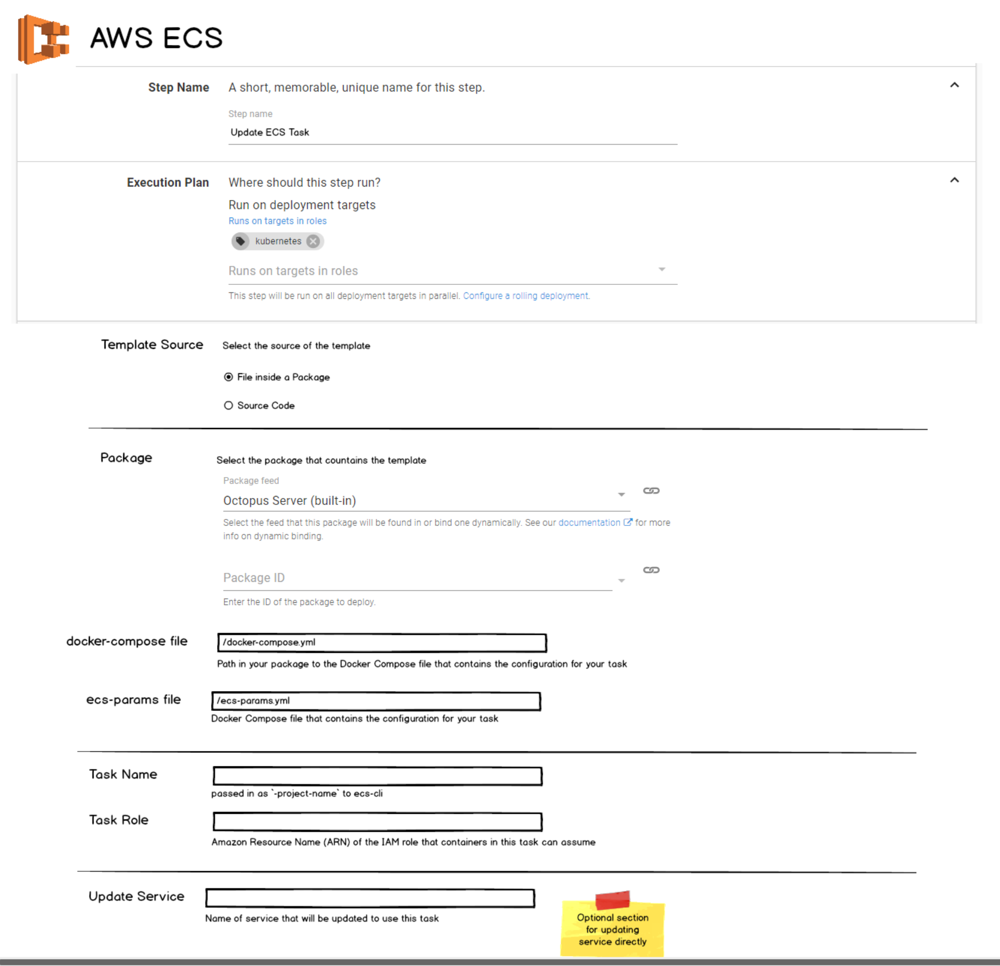

# Other Cloud Container Offerings

Prior to accepting that K8S have won the container wars, AWS and Azure had produced several container specific offerings. Ideally, we should have a good story for using these services through Octopus, even if that means leveraging library steps.

## [Amazon Elastic Container Services (ECS)](https://aws.amazon.com/ecs/)
ECS comes in 2 launch type options
1. Directly on EC2
2. Fargate - Avoids need to manage clusters. (Currently only available in N.Virgina)

#### 1. The provisioning of the EC2 cluster
This phase does not apply with a `Fargate`-style ECS service is being used. This could be managed by the user using existing CloudFormation or Script steps (e.g using [scripts](https://aws.amazon.com/blogs/developer/deploy-an-amazon-ecs-cluster-running-windows-server-with-aws-tools-for-powershell-part-1/)).

#### 2. Configuring Tasks
A Task consists of multiple docker container configuration plus a couple of ECS specific configs. For this reason the `aws ecs-cli` tool provides the ability to use `docker-compose.yml` files to provide the required configuration. Unfortunately this _is not supported by the AWS Powershell cmdlets_.

Configuring a task to support `Fargate` involves some _very slightly_ different configuration. (e.g. network mode non-configurable, host-port mappings are not available on containers and task constraints are not applicable)

#### 3. Configuring Services to use tasks

Although Tasks can be run directly on the cluster, services provide the ability to ensure that a min/max number of tasks are running at any given time. The biggest difference between `Fargate` and `EC2` services (apart from the task definition requirements above) is that `EC2` services allow you to customize how tasks are distributed across your cluster whereas with `Fargate` the cluster is abstracted away and so distribution configuration is not necessary.

Once a Service _is_ up and running, then it can be easily updated with a new task definition.

### In Octopus
* We can first of all assume that the cluser is either already provisioned, provisioned as part of a cloud formation template or `Fargate` ECS is being used and is therefore not necessary.

* A new ECS Task step can be created which takes a `docker-compose.yml` file and, similar to the k8s apply step is dynamically interrogated to determine the container "packages". As part of this step a service can be optionally provided which will be updated with this new task when complete. Alternatively the task ID will be put into an output variable so that it can be referenced used in subsequent steps. This step would need much of the same functionality as the k8s step.

 **The catch is we need to potentially bundle up the aws ecs-cli for this to work** The alternative is a step with the ability to add multiple containers and their configurations (basically a reproduction of what is provided in the AWS portal). It would be ace if this could be avoided but this is a workable fallback.

* An new `ECS Service` step could also be provided, which requires no new docker functionality and simply invokes the relevant powershell cmdlets to update\create the service. This step may not be required if the user is configuring the service in the task step above.

#### Otner Notes: 
* https://anthonychu.ca/post/aspnet-web-config-transforms-docker-containers/
* https://anthonychu.ca/post/overriding-web-config-settings-environment-variables-containerized-aspnet-apps/