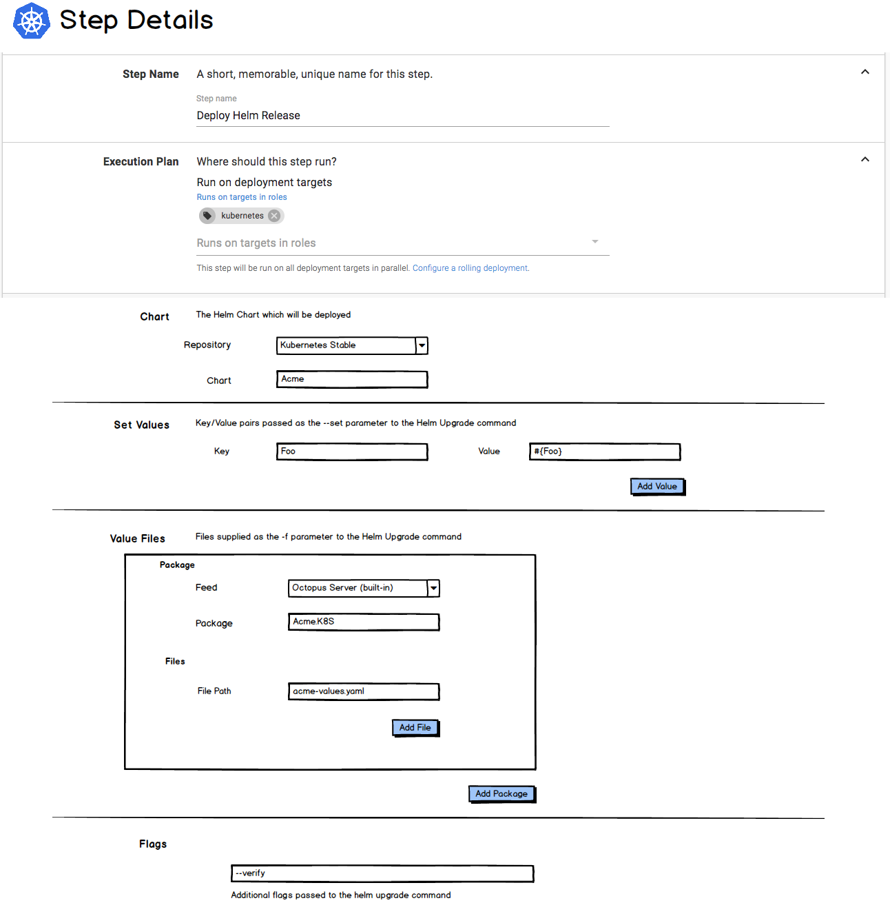

## Helm

[Helm](https://helm.sh/) has become widely used to package and deploy K8S applications. 

Providing first-class Helm support in Octopus could consist of: 

- Adding a Helm Chart Repository feed-type. 
- Adding a new step: [Helm Deploy Release](#helm-deploy-release-step)

### Helm Chart Feed

Helm Charts are published to [repositories](https://docs.helm.sh/developing_charts/#create-a-chart-repository).

It seems a fairly natural fit to allow adding Helm Chart Repositories as a feed in Octopus:

 

### Helm Deploy Release step

The Helm Deploy Release step would essentially wrap the `helm upgrade -i` command.  ie. upgrade a Helm release or install it if doesn't exist.

This step would be executed against a [Kubernetes Cluster target](index.md#kubernetes-cluster-target).

 

Any files supplied as Value Files would have variable-substitution performed on them. 
