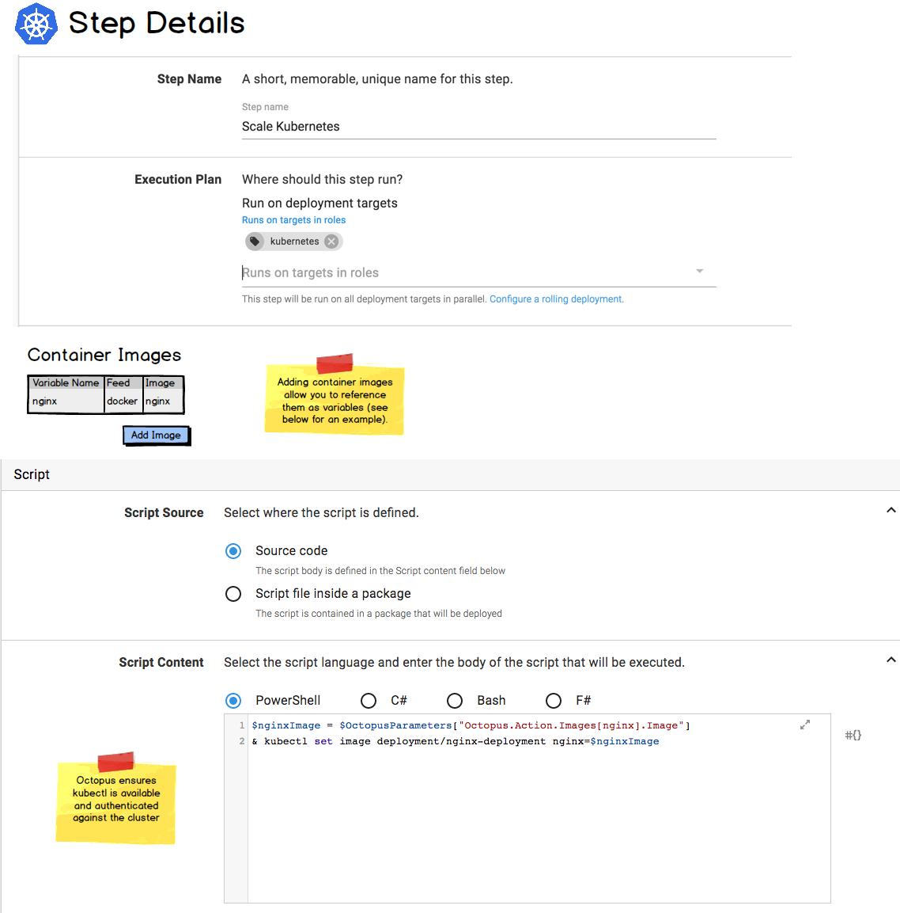

# Kubernetes

Support for Kubernetes in Octopus Deploy will take the form of:

- [New Target (Kubernetes Cluster)](#kubernetes-cluster-target)
- New Steps:
   - [Deploy Containers to Kubernetes](#deploy-containers-to-kubernetes-step)
   - [Apply a Kubernetes Template](#apply-a-kubernetes-template-step) 
   - [Run a Kubernetes Script](#run-a-kubernetes-script-step)

The steps progress along the User-Friendly <-> Flexible spectrum.  

Starting with the most user-friendly is the Deploy Containers to Kubernetes step.  It can be thought of in a similar way to the _Deploy IIS_ or _Deploy Azure Web App_ steps.  It provides a (hopefully) friendly UI, but simply can't expose everything that can be configured in Kubernetes.   

Next is the Apply a Kubernetes Template step.  This is conceptually similar to the CloudFormation or Azure ResourceManager template steps.  It allows the user to supply a declarative template to Kubernetes.  

Finally, the Run a Kubernetes Script step allows the user to write their own scripts, and Octopus will ensure the `kubectl` command-line tool is available and authenticated against the appropriate cluster.  This provides full-power, but not a particularly nice user experience (unless you enjoy writing bash scripts, in which case good for you).

## Helm

Given Helm's prevalence, we want a good story for deploying Helm charts. We have created a [spec for this](helm.md).

## Development Priority

The first priority phase is:

- Kubernetes Cluster Target
- Apply a Kubernetes Template Step 
- Run a Kubernetes Script Step

The seconds priority phase is:

- Deploy Containers to Kubernetes step
- Helm support

The reasoning for this is that the first phase enables all scenarios, and provides a path for anyone currently using Kubernetes to migrate their workflow into Octopus.   

The second phase provides a more friendly path for getting started with Kubernetes.  There will however be scenarios that are not achievable using the Deploy Containers to Kubernetes step. 


## Kubernetes Cluster Target

We will create a new target type, _Kubernetes Cluster_, to represent the cluster the Kubernetes Apply step will execute against. 


Conceptually this target is a URL and credentials for authentication.

We will support the authentication methods:

- Username + Password
- Certificate
- API Token


### Namespace 

The Kubernetes Cluster target will allow specifying a [namespace](https://kubernetes.io/docs/tasks/administer-cluster/namespaces/) (see mock-ui above). 

This will support dividing a single Kubernetes cluster into multiple logical environments (this model will still require multiple targets to be created in Octopus). 

The namespace configured will be written into the Kubernetes context established when connecting to the cluster.  

## Deploy Containers to Kubernetes Step


## Apply a Kubernetes Template Step

Kubernetes supports both [declarative and imperative modes of object management](https://kubernetes.io/docs/concepts/overview/object-management-kubectl/overview/#management-techniques).  

For Octopus, it seems a natural fit to support the declarative approach. This is implemented via the [kubectl apply command](https://kubernetes.io/docs/reference/generated/kubectl/kubectl-commands#apply). We will expose this via a dedicated step. 


The imperative approaches make less sense to implement via Octopus. We can always roll these out in subsequent phases if there is demand. For any of the imperative commands which do not specify container images (e.g. `kubectl delete`), these are relatively simply to implement in Octopus as custom script steps.

The `kubectl apply` command accepts templates (in either JSON or YAML). We will allow these templates to be either contained in a package (surely the more common scenario), or configured directly as source. 

### Container Image Replacement

The K8 templates specify container images. For example, the template below specifies version 1.7.9 of the nginx image.

```
apiVersion: apps/v1beta1
kind: Deployment
metadata:
  name: nginx-deployment
spec:
  minReadySeconds: 5
  template:
    metadata:
      labels:
        app: nginx
    spec:
      containers:
      - name: nginx
        image: nginx:1.7.9
        ports:
        - containerPort: 80
```

When creating a release of a project which contains Kubernetes Apply steps, we will potentially perform a two-step process:

First we fetch the package which contains the template (assuming it is sourced from an external template)
 
Second, we parse the retrieved template yaml file and locate any container image references. Since there is unlikely to be a simple way to determine _which_ feed contains the image listed in the configuration, Octopus will perform a lookup across all configured Octopus Docker feeds (unlikely to be more than a couple right?) for that image. The user will then be presented with the ability to select versions to override values specified in the config. Optionally if Octopus cannot locate the package then they will be presented with a message that no image could be found and so no Octopus overrides will take place.


It will not be necessary to supply versions for all container images specified in the template.  Any which do not have values supplied will simply not be replaced, and will use the version specified in the template.

If the release is created via the API, then the versions of the container images will be passed just as regular package versions are supplied when creating a release.

At deployment time, we will take any specified container image versions and substitute them into the template, before it is passed to the `kubectl apply` command.

### Impact on Octopus: multiple packages per action

One big side effect of this feature for Octopus deploy, will be the requirement to support multiple packages for a single action. At the moment any steps that require a package contain the information under `Octopus.Action.Package.PackageId`, with this change the suggested approach would be to index the package details under the name specified by the image in the configuration. In the example above, this might look like `Octopus.Action.Package[Nginx].PackageId`, `Octopus.Action.Package[Nginx].FeedId` etc. This will require changes to Octopus Server and Calamari.

### Variable Substitution

General Octopus variable-substitution will be applied to the template.

Unfortunately Kubernetes doesn't support parameters files, as AWS and Azure do with CloudFormation and ResourceManager templates. This means that inserting Octopus variables into the template will make it invalid as a standalone template.

In future phases it may be nice to add support for additional configuration-replacement options.  One option is to support JSON transforms, similar to the way Octopus supports web.config transforms. Another option is to add support in the Apply step for setting environment variables on the container elements in the template.  This would be a key-value pair configuration, binding an Octopus variable to an environment variable.  


### Output

The output from the `kubectl apply` command will be captured as an output variable.

The output format can be specified (see the `output` flag of the [kubectl apply cmd](https://kubernetes.io/docs/reference/generated/kubectl/kubectl-commands#apply)). One of the options is JSON (which can be further customized using the `jsonpath` option). Using the JSON properties functionality which is available in Octostache, this should be useful.

### Run a Kubernetes Script Step 

There are many other [Kubernetes commands](https://kubernetes.io/docs/reference/generated/kubectl/kubectl-commands) you may wish to execute, other than `apply`.  For example: [deleting resources](https://kubernetes.io/docs/reference/generated/kubectl/kubectl-commands#delete), [scaling](https://kubernetes.io/docs/reference/generated/kubectl/kubectl-commands#scale), etc.

We will enable these by adding a new flavor of a Run a Script step: _Run a Kubernetes Script_. 

This step will allow you to write your own scripts, and we ensure the `kubectl` command line is available and authenticated against the Kubernetes cluster the step is targetting.  This is conceptually similiar to our [Run an AWS CLI Script](https://octopus.com/docs/deploying-applications/custom-scripts/aws-cli-scripts) or the  [Run an Azure PowerShell Script](https://octopus.com/docs/deploying-applications/azure-deployments/running-azure-powershell) steps, which authenticate against and provide the SDK for AWS and Azure respectively. 




### Container image references

We will allow adding image references to a _kubectl Script Step_ (see UI-mock above).  This will allow referencing them as variables in the script.  The image tag (package version in regular Octopus parlance) will be selected at release-creation time.


## Secrets and ConfigMaps 

A significant part of the value in integrating Octopus and Kubernetes will be pushing variables from Octopus into a K8S cluster.

Secrets and ConfigMaps can both be created using the Apply step (or the Kubectl Script Step).

In the future (i.e. probably not part of v1), it may be valuable to create dedicated steps for creating these.  Something like:


