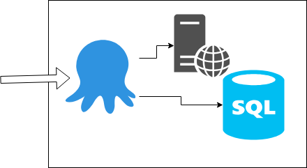
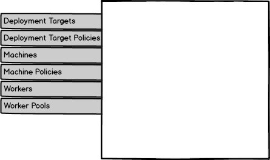
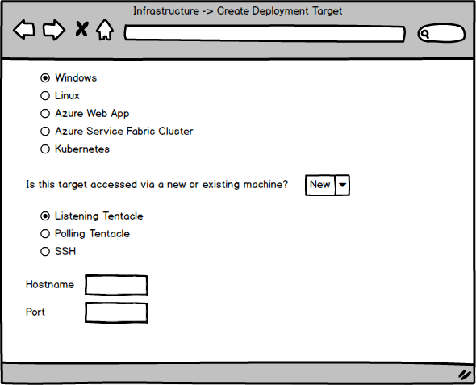
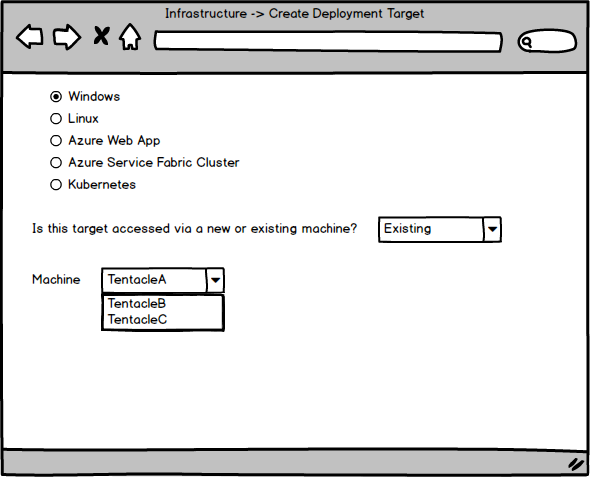
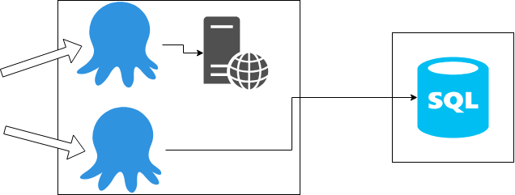
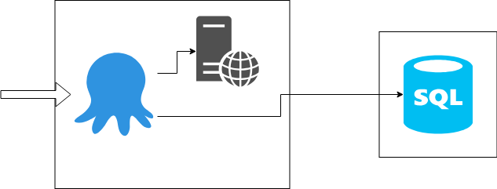

# Machines and Deployment Targets

The purpose of this spec is to outline a change to the way Octopus models machines and deployment targets. In our current model these concepts are very much one-to-one and they are very tightly coupled together.

Splitting the concepts into separate pieces would have a number of advantages, from both a customer and Octopus maintenance perspective. **It will allow Octopus to have better insight into the real world of the environments it is deploying into and lead to greater value to customers, through growth in operations capabilities.**

# Some of the backstory

Octopus has historically modelled Machines and Deployment Targets as one "thing". Machines started out as a representation of a Tentacle machine that Octopus server is in communication with. That machine would be the target of a deployment or script, and we used the steps to conceptually represent multiple targets, if there were multiple. Let's consider an example.

Let's say we have an intranet web site hosted using IIS and we have a Tentacle installed on that server. Let's also assume we're in a world where the Tentacle can be running as a user who has local admin AND dbo permissions to a SQL database that backs the site. We'd probably then add this Tentacle to an environment in Octopus, assign it roles like "Web Server" and "DB Installer", and have a deployment process along the lines of 

1. Stop site
2. Upgrade DB
3. Deploy site package
4. Start site

So there are two things we're actually deploying to here, IIS and SQL Server, but we represent them as a single Machine/DeploymentTarget and the project has to manage the scoping of a potentially large number of variables to manage the physical world across multiple environments.



The model here was always around "the machine/deployment target is WHERE the deployment executes". The terminology "machine" was about which endpoint we had to communicate with to initiate the execution on that physical server and "deployment target" was used interchangeably, because of the 1-1 relationship, and still meant "the Tentacle".

## Cloud targets

Around the v3.0 timeframe things evolved and other targets started to appear. These were similar, but a bit different. Targets like Cloud Services and Azure Web Apps have scope (environment, tenant etc) just like a Tentacle, but they are SaaS/Paas things and you can't install a Tentacle on them. So how to model them? The deployment pipeline uses a table called Machine, we could just make these special machine types that you don't actually execute on but still represent your deployment target. And the machine table's multiple personally disorder was born.

While this has worked, it has created some interesting complexities in the code and confusion in the way we talk about some things.

# Machines separated from Deployment Targets

The purpose of this spec is to outline some of the steps and considerations around addressing the machine's personality disorder.

The main crux is for us to separate Machines and DeploymentTargets into two completely separate objects in our model. A Machine represents somewhere a deployment can execute and the communication style required to converse with it. So Listening/Polling Tentacles and SSH would be the resulting machine types. Workers won't remain a derivative of Machine, but will continue to hold a lot in common with them.

A DeploymentTarget represents a thing we are deploying to and can specify a constraint around where it's deployments can execute (i.e. must be on a specific Machine OR can execute on any Worker from a given pool).

This separation lets us model a number of things in ways that more closely represent the real world. Let's revisit our example from earlier, imagine we have a test environment where IIS and SQL live on the same server. We install a Listening Tentacle machine and add it to the Test environment. We then create a Tentacle DeploymentTarget to represent the things we're deploying to and the process and variables stay the same as they were. In Production maybe IIS and SQL are separate, so we create two listening Tentacles with a machine entry each and a Tentacle target each.

This all sounds like more work and complexity for the user though, why would we want that?

## Non-targets

As an extension to this, what if there are things in the real world that are important to the deployment process but they aren't things we're actually deploying to. To give a working name to this idea for the moment, let's call these things Assets.

A common example of an asset that we've talked about in the past are load balancers and reverse proxies. These aren't things we're deploying directly to, but we have to know about them for doing things like rolling deployments and blue/green deployments.

Modelling these as first class members of our world moves us a step closer to being able to visualise an environment in a much more detailed way for our customers.

Assets probably wouldn't be things we'd need to health check, but maybe knowing they are healthy is of value? Once they are part of our model, and we know how to connect to them, it's a small step to be able to allow scripted health checks on them.

## Portal UI

The suggestion here is a higher fidelity model to open some doors, we'll talk more about these doors below.

At the same time we don't want to complicate things for those who don't need that fidelity. Here are some initial thoughts around the UI and workflow.



Machines and Deployment Targets will have their own pages in the Infrastructure area. The current page called Deployment Targets actually shows entries from the machine table, it would change to showing entries from the DeploymentTargets table.

To represent what customers do in Octopus today, we will create a "Generic Target(s)" (exact name is up for consideration), which would be used by the Listening Tentacle, Polling Tentacle, and the SSH machines.

When creating a generic target we could ask whether this is for a new machine or an existing machine. **New** would be the default and result in much the same UI as today, and we'd create the records in both tables for you. 



**Existing** let's you take advantage of the new 1:many and would list machines with matching scope (env, tenants etc) to use for deployments.



For all other deployment target types the machines aren't relevant, you'll be specifying a worker pool just like today. The difference under the hood here is that you end up with a record in the DeploymentTarget table, rather than the Machine table.

From the other end, we could do a similar thing when creating machines. We could ask the user if they want to create a new generic target as part of creating the machine, and if so they just need to enter the name and role(s) for the target.

This would keep us close to the single page create experience we have today, without stopping the users from utilizing the new functionality. _Initial conversation with Jess indicates there may be reason to jump the user to a separate page or dialog or something to do the creates._

## New target types

This new model opens some doors for us. One is the ability to model multiple deployment targets on a single machine. Imagine we had deployment target types for things like IIS, SQL, Oracle, etc.

Now imagine our IIS/SQL example again. We could have 1 machine with 2 deployment targets in the Test environment, and in production you'd see 2 machines with 1 deployment target each. This means Octopus can visually display a more accurate representation of your environments.

## User context

The user the deployment is running as often becomes a problem for many of our customers. What happens if you can't install a Tentacle for your application on your separate SQL server/cluster? You usually have to do the SQL work remotely, often from the IIS server. But what if the user who can work with IIS isn't the same user who has access to the SQL database? (this happens all the time with Integrated Authentication to SQL).

In the current world, you have to install 2 Tentacles on the IIS server, run them as different users and assign them different roles.



What if there was a way to control which user the deployment executed as? We can do this in some circumstances today, but what if the deployment target could specify user credentials to run as? Then the 1 Tentacle machine could just execute the individual steps by calling Calamari as the required user for the target of that step.



## Health checks

The next door that this separation opens is the ability to have health checks for machines as well as deployment targets. What's exciting about that?

Machine health checks are really about "can I connect to the machine to execute a deployment on it". This still holds for listening/polling Tentacles and SSH machines. What's exciting is that we could have separate, more detailed, health checks for targets because they are different things.

What we've already been looking at with the Azure cloud targets we recently introduced is that health checks for a targets are actually more about what state the thing you're deploying to is in. For example, for an Azure Web App there can be states like "Doesn't exist yet", "Exists but has never been deployed to", "Has been deployed but a nominated IsAlive endpoint isn't responding", "Has been deployed and nominated IsAlive endpoint is responding".

For SQL we could do things like, "database doesn't exist", "database exists but is blank", "database exists and has schema version X".

The ability to have this level of detail in health checks will allow us to surface far richer information for our customers. Today they can 

## Events

Given that health checks will be separate, it follows that events for machine and deployment targets will also be separate. We can support state change events like "when the database exists" to represent what's happening in each target type.

We can also couple this with Maintenance processes, once they are done. An example of this could be using an event like "when the IsAlive endpoint doesn't respond" to trigger a process that removed the target from a load balancer. Conversely, when the IsAlive endpoint does respond add the target to a load balancer. I know, load balancers probably have this built in, it's an example :)

Maybe a better example is "when the target doesn't exist" kick off a maintenance process to create it and auto-deploy to it. This would cover something like a web site being deleted via the Azure portal and Octopus could kick in a recreate it. This would suit what is essentially a DSC scenario, where Octopus is detecting and correcting drift.

You could also make Octopus purely reflect what's in Azure, i.e. if the web site gets deleted in Azure then the maintenance process removes the target in Octopus.

## Project variables

One side effect of the targets model is that you can usually reduce the number of variables you have to deal with at the project level. Most of the time the variables are really representing attributes of the targets we are deploying. Some examples are database connection strings, application pools, and IIS bindings. In today's world you have the complexity of trying to join all of the variables together in your mind for each target in each environment.

Once you move to targets, all of these things become first class properties of the target and it's very easy to reason about what the configuration for a given environment/tenant actually is.

## Calamari Variables

A point of confusion currently are variables like *Octopus.Machine.Name*. If you're executing on a Tentacle then this will be the Tentacle's name. However, if you're running on server/worker then this value will actually be the name of the Deployment Target (because it's really just the Name value in the Machine table for both).

This has caused some issues and confusion in certain scenarios with workers, because you can't pass values related to the worker/pool because those names are already reserved for the target's use.

We'll separate these and have variables for *Octopus.Machine.Name* and *Octopus.DeploymentTarget.Name*, for example.

## Referencing variables for other targets

In scenarios like the IIS and SQL one we have been using, it is common to need to do things like build connection strings for the IIS web config based on the SQL server database variables for the environment. Now that we have a sense of what types of assets are in scope, we may be able to allow variable substitution based on target type. The idea might be that for the connection string you have a binding value that contains something like the following

```Server=#{Targets["SQLServerDB"].ServerName};Database=#{Targets["SQLServerDB"].Name};Trusted_connection=true```

In this notation, the `SQLServer` value is denoting a target type. This concept would only work when there was a single instance of the target type in the scope, if there a multiples we would have to fail the deployment because we couldn't uniquely identify the exact target.

In the example above the assumption is that there would be only 1 SQLServer target in scope. We could support including Role in the scope (where scope would normally be Env and Tenant) to uniquely identify specific targets. Let's say your application has a transaction database and a reporting database, as an example. Maybe something like 

```Server=#{Targets["SQLServerDB:TxnDB"].ServerName};Database=#{Targets["SQLServerDB:TxnDB"].Name};Trusted_connection=true```

to denote "the SQL Server database with the role TxnDB".

This would again improve the usability for the user, by moving more things away from the complexity of the project variables and towards relating things together in ways that more closely represent the physical world.

# Migration

Migrating the data for this change will revolve around creating a DeploymentTarget record matched to every existing Machine record, with the appropriate fields moved across.

Machine records for all things that aren't Tentacles or SSH can then be removed.

# Licenses

The terminology around licenses relates to targets, so the counts currently based on the Machine table would simply move to be based on the DeploymentTarget table.

# Backwards compatibility

This will possibly be one of the trickiest parts of the implementation. To maintain compatibility with older version of Octopus.Client we could use a similar approach to the UI. In the current world things are 1:1 so we maintain that and create machine and deployment targets appropriately.

The new client will understand the separation and support it as a first class concern. Depending on the complexity we may be able to make it compatible with old scripts but this will require further investigation.

# Remaining questions and futures

We've thought about representing load balancers/reverse proxies, e.g an F5, to make rolling deployments, blue green deployments etc easier to visualise. But they aren't a Deployment Target. They feel more like a Machine where we'd want to execute a script.
_Non-targets section above may address this now_

Roles would be on the DeploymentTarget, not the machine. If we get to making Roles a first class thing, should they be able to say "I can be used on these target types!", e.g. so "DB installer" can only be used on a SQL target and not an IIS target. The next piece in this is for the steps to know which target types they support, and therefore which roles to display.
Would this then even mean that roles could become optional? E.g. if the step didn't specify a role then it'd deploy to all targets of the correct type in the environment.

How should scopes like Environment and Tenant work? It feels like they belong to DeploymentTargets for non-Tentacle/SSH things. But for Machines should we also be able to constrain to say "Only deployment targets for Production for TenantA can use this machine"? It doesn't sound unreasonable, but will the complexity/headaches it will add be worth it?
