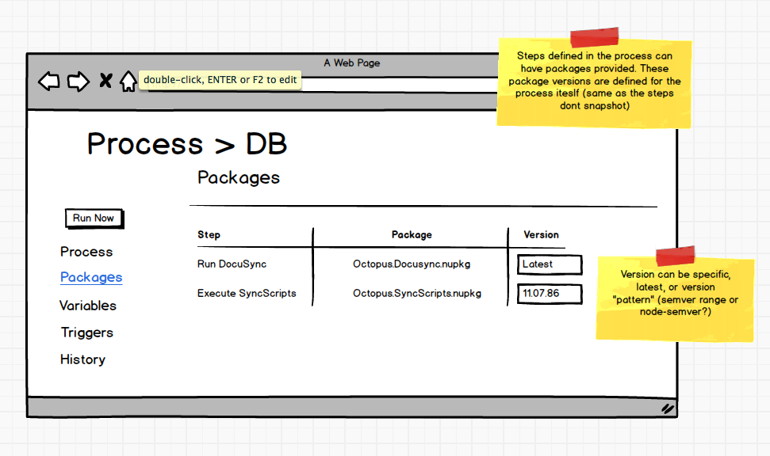

# Maintenance Processes #
_Note: The name "`Maintenance Process`" is still up for discussion so don't get hung up on it... ok?_

## TLDR; ##
There exists a need to run a set of steps, similar to a deployment process, but outside the scope of any specific release. These processes need to be able to be run on demand or via some trigger and although they would be lacking any lifecycle progression or snapshotting, there would still be a need for some variables and environment scoping.

## User Requests ##
[UserVoice #17696959 - Crete jobs for recurring tasks (6 votes)](https://octopusdeploy.uservoice.com/forums/170787-general/suggestions/17696959-create-jobs-for-recurring-tasks-use-permissions-t)

[UserVoice #6905729 - Support Tasks on the tentacles (2 votes)](https://octopusdeploy.uservoice.com/forums/170787-general/suggestions/6905729-support-task-on-the-tentacles)

## Design ##
##### No Snapshots #####
Apart from having processes and variables, maintenance processes and projects are a different beast. Maintenance processes have no life cycle, so they can be executed to any environment at any time without regard for previous executions (assuming valid permissions). Since there is no specific release, it also makes sense that there need be no channels either. As a result of this, there is also no concept of snapshotting. The execution uses the current values available to that process at the time that it runs. This includes tasks that are scheduled to occur at a later date or on a schedule. Snapshotting makes sense in the project world, where your aim is repeated deployments of some artifacts (or scripts) that must incrementally complete a controlled progression through a defined life cycle. Maintenance processes exist and run as independent one-off tasks. If existing schedules need to continue untouched while at the same time running a newer process, the lightweight design of maintenance processes means you can just clone and edit a whole new process. If this is still not enough, it may be that what you really want is a project, you just don't know it :) .

##### Context #####
A maintenance processes lives outside and at the same level as projects (eventually at the `Space` level). Although it was considered that they could live _additionally_ within a project (so a project can have its own maintenance tasks), this adds unnecessary complexity considering we would still want project-less maintenance processes that can be avoided by managing them all in one place. Since the end goal of `Spaces` should provide better organization of project ownership, this level should provide a good balance between ending up with a dumping ground of processes, and being actually relevant to the people who need them. See _further work_ below for some additional v2 features that would support better integration with project scenarios.

#### UX ####

The process screen looks very similar to a project `Deployment Process` screen. All the same steps available to a project are available to a maintenance process which could be package steps, library steps or even "rolling" steps.

Since there is no "Create Release" step, any package steps need to have their versions defined up-front. In the same way that the steps themselves aren't snapshotted or versioned, it makes sense that the packages used in the process are also pre-defined up front since they may be tied to the process being used. The version can be specific as they are today, or they can use some sort of "pattern" such as [node-semver](https://github.com/npm/node-semver) to get the latest (or they can select just plain old "latest")

Maintenance Processes are executed against specific environment(s) since they need to run "somewhere". For this reason providing the ability to add variables may be required to provide different config for the different deployment contexts. For example you may have a process which updates certificates. You may need to use a different HOST value for the different environments but the rest of the process of requesting and installing the certificate will likely be the same. You can then leverage the one maintenance process for both cases, potentially on different schedules. The same could also be said for roles or tenant tags.

When  maintenance process is run on-demand the process is run within some context. This context is much the same as a project deployment. There must be an environment and can optionally be a tenant or tenant tags.

Additionally Maintenance processes can have triggers very similar to Project Triggers. Some system events such as "new machine" or "project deployed" events may cause the process to execute, or they could be scheduled to run on a repeated basis. An execution context must still be provided however a templated environment can be selected as the target. In this case, the environment(s) are just determined _at the time of execution_.

Once a process is kicked off it is effectively treated like any other server task. 

_Mockups available in [Maintenance Process.bmpr](./Maintenance_Process.bmpr)_

### Further Usage ###
The current implementation of subscriptions feels like it could be subsumed by this concept of maintenance tasks. A subscription currently listens for a trigger, then either fires off an email or invokes a webhook. This describes a maintenance task with a single step however with the addition that users could further customize what they want to happen when these triggers fire. To replace subscriptions there will need to be the concept inside the event triggers section of maintenance tasks of some sort of "debounce" ability.

### Running with projects ###
A valid scenario might be as follows:
> Jim deploys his application which is made up multiple microservice projects and a database project. He wants to hit the web application every hour and send a slack message if it returns a 500.

In this scenario it sounds like the deployment process needs to be somehow tied to a project, so that we can share project variables. We may even want to access the output results of a deployment to use the specific url of the webserver spun up during that deployment.

What we really want is the ability to access deployment-scoped variables. It doesn't make much sense to talk about purely project variables since they really only have meaning _during_ a deployment; Think about variables that use environment or output variables.

Instead what might solve this is providing a new variable type called `Deployment`. This could be selected from 

## Vision Fit ##
### Octopus as Enterprise ###
n/a

### Octopus as Cloud-First ###
Maintenance processes are a piece that lays the groundwork for the development of `Transient Environments`. In order to provided the ability to provision/de-provision entire environments on-the-fly, it is through the invocation of maintenance processes that might involve steps like an `AWS CloudFormation` step type to set up the new infrastructure.

### Octopus as Hosted ###
n/a
