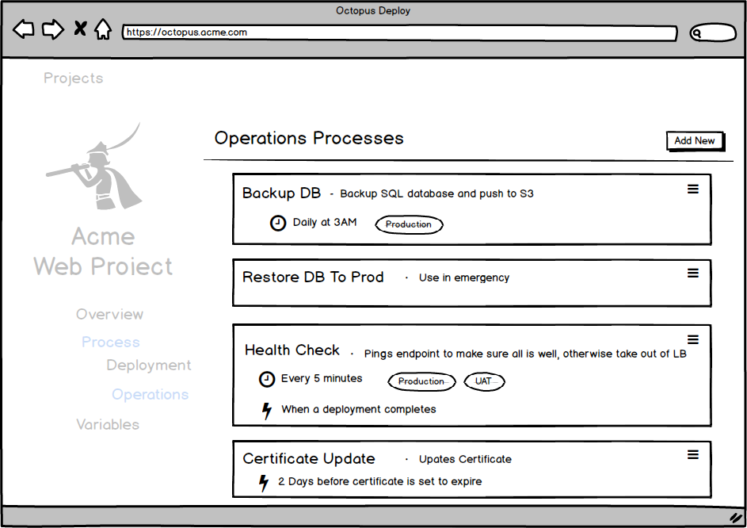
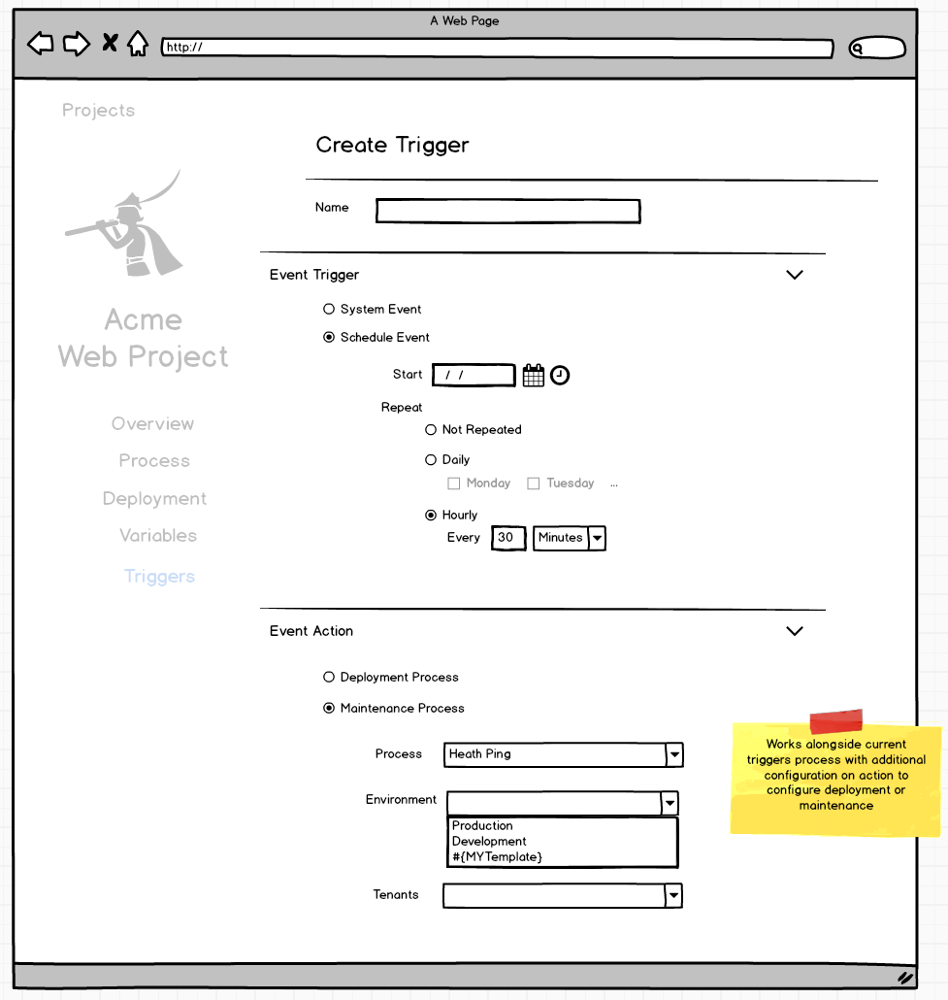

# Maintenance Processes #
_Note: The name "`Maintenance Process`" is still up for discussion so don't get hung up on it... ok?_

## TLDR; ##
There exists a need to run a set of steps, similar to a deployment process, but outside the scope of any specific release. These processes need to be able to be run on demand or via some trigger and although they would be lacking any lifecycle progression or snapshotting, there would still be a need for some variables and environment scoping.

## User Requests ##
[UserVoice #17696959 - Crete jobs for recurring tasks (6 votes)](https://octopusdeploy.uservoice.com/forums/170787-general/suggestions/17696959-create-jobs-for-recurring-tasks-use-permissions-t)

[UserVoice #6905729 - Support Tasks on the tentacles (2 votes)](https://octopusdeploy.uservoice.com/forums/170787-general/suggestions/6905729-support-task-on-the-tentacles)

## Design ##
##### No Snapshots... Kinda #####
Apart from having processes and variables, maintenance processes and projects are a different beast. Maintenance processes have no life cycle, so they can be executed to any environment at any time without regard for previous executions (assuming valid permissions). Since there is no specific release, it also makes sense that there need be no channels either. As a result of this, there is also no concept of locking a process to a specific version through snapshotting. The execution uses the current values available to that process at the time that it runs. This includes tasks that are configured to occur at a later date or on a schedule. Snapshotting makes sense in the project world, where your aim is repeated deployments of some artifacts (or scripts) that must incrementally complete a controlled progression through a defined life cycle. Maintenance processes exist and run as independent one-off tasks.

 ...Having just said all that, some form of behaviour should be available for users to change and test their processes while still allowing them to "undo" changes. To achieve this, a copy of the process will be automatically stored when an execution takes place that differs from the last time it was run (so the history is always based on actually executed processes as opposed to interim edit-save-edit-save iterations). Although all execution still only ever occurs based on the _current_ process, the user has the ability to revert that process back to a previous version if so desired.

 If existing schedules need to continue untouched while at the same time running a newer process, the lightweight design of maintenance processes means you can just clone and edit a whole new process. If this is still not enough, it may be that what you really want is a project, you just don't know it :).

##### Context #####
A maintenance processes lives inside a project. By storing maintenance tasks inside a project, the task execution context will get all the benefits of the project variables already defined. If a project is devoid of any deployment process, and only has maintenance tasks, then it's dashboard should be focused on maintenance tasks as opposed to deployment history.

#### UX ####
The maintenance tasks are accessable via the process section of the project.

The process screen looks very similar to a project `Deployment Process` screen. Most of the same steps available to a project are available to a maintenance process as well as the feature of "rolling" steps. It is possible that some steps might be unavailable in maintenance tasks, such as `Deploy A Package` step which might just be replaced with something akin to `Extract A Package`.

Triggers can be applied to maintenance tasks similar existing Project Triggers for deployments. Some system events such as "new machine" or "project deployed" events may cause the process to execute, or they could be scheduled to run on a repeated basis. An execution context of environment and/or tenant can be provided (however a templated environment can be selected as the target. In this case, the environment(s) are just determined _at the time of execution_.) Any packages that are required also need to be defined, however the packages may be defined as `latest` rather than pinned to a specific version.

When  maintenance process is run on-demand, the process is run within some context. This context is much the same as a project deployment. The environment and tenant contexts are optional, however the execution may encounter an issue at execution time of the step tries to run against a target and none exist. Any available packages need to be selected at this point as well.

Once a process is kicked off it is effectively treated like any other server task. 

_Mockups available in [Maintenance Process.bmpr](./Maintenance_Process.bmpr)_

### Further Usage ###
The current implementation of subscriptions feels like it could be subsumed by this concept of maintenance tasks. A subscription currently listens for a trigger, then either fires off an email or invokes a webhook. This describes a maintenance task with a single step however with the addition that users could further customize what they want to happen when these triggers fire. To replace subscriptions there will need to be the concept inside the event triggers section of maintenance tasks of some sort of "debounce" ability.

### Running with projects ###
A valid scenario might be as follows:
> Jim deploys his application which is made up multiple microservice projects and a database project. He wants to hit the web application every hour and send a slack message if it returns a 500.

In this scenario it sounds like the deployment process needs to be somehow tied to a project, so that we can share project variables. We may even want to access the output results of a deployment to use the specific url of the webserver spun up during that deployment.

What we really want is the ability to access deployment-scoped variables. It doesn't make much sense to talk about purely project variables since they really only have meaning _during_ a deployment; Think about variables that use environment or output variables.

Instead what might solve this is providing a new variable type called `Deployment`. This could be defined in-place to use `latest` or `previous` or left empty to be provided later. The consuming process, in this case the Maintenance Task, could then use dot-notation to access values generated as part of that deployment. This feature would also be a great addition to standard projects as well.

E.g.
A user defines a variable in the Maintenance Task variables grid called `LastDeployAcmeWebApp`. When setting the variable they select it's type as `Deployment` and are prompted to select a project. They select the `AcmeWebApp` project and are then prompted with input to select a specific, previous specific deployment or the option for `latest` or `previous`. The user selects `latest`. When the maintenance task runs it retrieves the _latest_ deployment for that project in the same context as the currently executing maintenance task (environment/tenant). This may be the full variable manifest or it may just be the variables the user has explicitly opted to retrieve via the `set-OctopusVarible` cmdlet. The variables are now available via standard octostache dot-notation so that the task can access `#{LastDeploymentAcmeWebApp.DeployedUrl}` endpoint which tends to change between deployments.