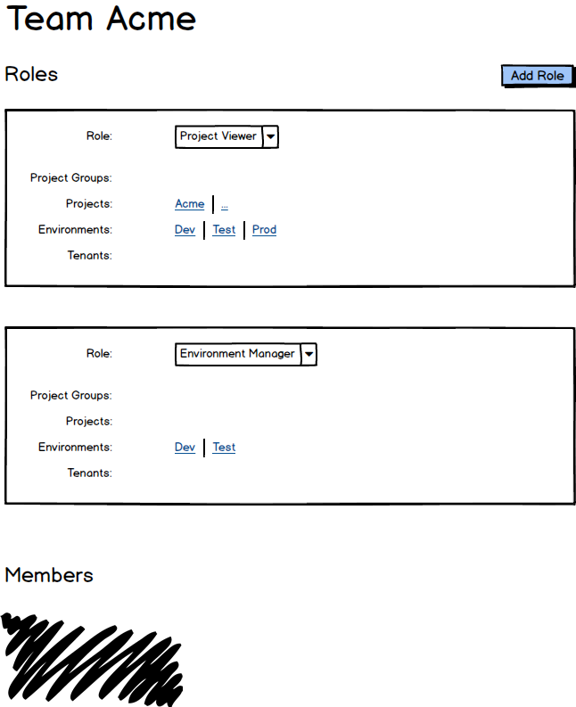

In the [previous document](SimplifiedPermissions.md) we designed an ideal permissions model if we were starting over today.  But we're not starting over, and unfortunately we couldn't produce a palatable migration strategy from the current permission model to our proposed model.

The greatest benefit (from a development perspective) of the previous proposed model was also the greatest difficultly for migration: _Being able to view everything in a Space_.  The idea that a user could go from being able to see two projects one day, to suddenly being able to see hundreds was a deal-breaker. 

# Plan B 

## 1. Individually Scoped Role Assignments

On Teams today you can scope Role assignments (to environments, projects, etc). But you are scoping _all_ Roles for that Team.

We will change this to be scoped per Role. This will allow more fine-grained assingments and should result in the creation of fewer Teams which better map to real world teams.

## 2. Most Roles Assigned within Spaces 

**Roles will exist at both the Server and Space levels**.

Whereas today all Roles are at the Server level, in this model most Roles will be assigned to Teams at the Space level.  

The only Roles that will remain at the Server level are those related to administering the Octopus Server, manage Spaces, and publish packages to the built-in feed. 

All Roles relating to Projects, Environments, Tenants, etc, will be pushed down into the Spaces. e.g.

- Project XXX
- Environment XXX
- Tenant Manager

For example, the `Acme Developers` Team may be assigned the following Roles within a Space:

| Role                | Scope                             | 
|---------------------|-----------------------------------|
| Project Contributor |                                   | 
| Project Deployer    | Project:Acme; Environment:Dev     |
| Environment Manager | Environment:Dev                   |

## 3. Space Owners 
Spaces will have owners. A space owner will act like an administrator within that space, in that they can do anything in that space. The owners of a Space can assign permissions for the Space.  Octopus Administrators will be able to delegate the management of a Space.   

Octopus Administrators do not have permissions within a Space by default. 

It is important that it is easy to give users access to everything in Octopus, and that this is easy to do for new installations. This can still be done by combining the Octopus Administrator permissions with the space owner permissions.

# Migration

Migration to this model is fairly trivial.  If this is implemented at the same time as [Spaces](../Spaces/index.md), then everything will be initially placed in a default Space, and all existing Roles will be allocated in this Space.  

All Teams will remain.

Existing Octopus Administrators will have the ability to Create\Modify\Delete Spaces.

Existing Octopus Administrators will be the owners of the default Space.

# Development

One of the motivations for re-considering the permissions model was that the Octopus engineering team finds the current model difficult to implement correctly and also to test.

Given that we will need to extensively test permissions as part of implementing Spaces and these proposed permissions changes, there is no reason this can't still be an opportunity to refactor the permissions code and improve the development experience.

We should:

- Document the current permissions behaviour
- Refactor the code to make it as easy as possible to implement this model
- Improve our permissions automated-test coverage
- Create better development tooling for testing with various permission configurations 

