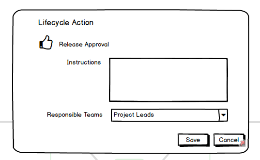

# Pipelines

**The primary motivations behind this feature were twofold.**
1. **Allow additional non-deployment steps to take place as a release progresses through a lifecycle that may determine if progression can continue.**
2. **Provide a smoother UX flow when using Octopus and setting up a new Project**

## TL;DR

- Lifecycles and channels dont move. We will always want global progression rules (lifecycles) and ways to link them to projects (channels). Let's not move cheese for the sake of it if we will always need concepts at the levels that these already live.
- Lifecycles allow adding "lifecycle actions".
    -  Can be before/after a phase (e.g. approval is needed before _any_ production release)
    -  Can be before/after an environment (e.g. Testing phase has 3 environments, I want to run testing on _each_ of them before the deployment can progress)
- As part of a separate proposal for external feed ARC, the package rules _may_ be managed outside of channels.
-  **Pipelines do not exist.. We keep the existing concepts!**

## Smoother UX Flow
One of the common complaints in Octopus is the need to keep jumping around between pages when setting up a project (citation needed). Common design patterns include modals dialogs (which can be problematic when needing multiple layers) or Azure blades (which can make the page noisy and end up reducing the amount of usable space when "too deep").

We have an existing pattern in octopus for selecting\linking related entities that we should make better use of

The accounts control allows for `Adding New` which opens up a new tab, and `Refresh` which will include the new account when available. I see no reason that we shouldn't extend this concept for other entities.

In addition, the portal should make a greater use of images and graphics to provide quicker differentiation when multiple options are available. For example, when selecting a lifecycle for a channel, you are currently hit with a wall of names which may or may not bear any relation to what the flow actually looks like.

Instead, this particular drop down should provide a graphical representation of the lifecycle. Even as a simplified model (phases collapsed) this approach seems like it would be quicker for the user to know what they are looking for.

## Lifecycle Actions

### Managing Channels
Channels stay as the link between project and lifecycle (and potentially a seperated package rule down the track) and the same relationship exists as it did before. Although an alternative was considered (where a single "master" lifecycle could serve as the basis for multiple channels which simply flag phases to be skipped) it is simpler in many ways to keep the status quo.

When editing a channel, the lifecycle selection goes from the current flat drop down list, to something that allows viewing the options along with the new `Add/Refresh` paradigm.

From the channels edit page, the selected lifecycle is displayed with a graphical representation of the progression directed graph. Actions can then be added before/after a phase, or berfore/after an environment. In the case of single environment phases, this is effectively one and the same so can be treated as an environment-action (to account for the case when an additional environment is then added to that phase, better to default to too many actions than not-enough).

Clicking the `Add` icon at of these points in the lifecycle brings up the option to add a new action. 

The different action types will likely have different options that define how they interact with the progression.

When a maintenance action is applied to a specific environment (as opposed to phase) the task can then include that environment's context.

### Dashboards
#### Project Overview
Since the project overview would then need to take into consideration these intermediate steps in a lifecycle, it may need to be re-imagined somewhat. 

Perhaps grouping together phase-environments horizontally

or vertically

The key factor is that a task could take place after/before an environment (like a test) or before/after a phase (like approvals).

#### Dashboard
On first consideration, it seems unnecessary to make any changes to the site-wide dashboard. This dashboard acts as a window into the current state of the world for which project versions are in which environment. Since it is simply a list of Project X Environment it's not entirely clear how a lifecycle action would fit into this picture.
A release approval not yet flagged for production might look a little unexpected in the UAT column next to that release. Similarly it wouldn't look right in the production column alongside the "current" release for production which may itself be several releases ago. Ultimately if a user is interesting in why a project hasn't progressed then this is information that will be available whe they click the project and drill into the project overview.

### Snapshotting

#### Delayed Snapshot
A common pattern when making changes to a deployment process is the `edit process` -> `create release` -> `deploy` -> `fail` -> `repeat` cycle. While we want to encourage the snapshotting behavior for later phases, perhaps this makes less sense in the earlier (or first) phases where there are constant changes required. What if we allowed on the lifecycle the ability to create a snapshot point at some phase. Typically this might be right after the dev phase (or currently by default before the first phase). This would allow quicker iteration on packages and/or deployment processes.

#### Reuse Old Snapshots
In the other direction, it may sometimes be the case that a user wants to redeploy a release using an earlier "known-good" configuration (e.g for an urgent hotfix for `v1.x` while the deployment process is now set up for `v2.x`). There is currently no simple way to deploy a package with an earlier configuration.  So the user has made all sorts of changes to the project required for getting ready for `2.0.0`. But in the meantime a bug is found in `1.4`. How do you ensure tht your hotfix will use the right variables and deployment process?

What if when creating a release we allowed the user to "select" a deployment process from a previous release. Instead when you go to the create release page by default it is showing from a drop down Process= `Latest`. Since we still have the deployment process snapshotted however they can then select from the drop down Process=`Release: 1.5.0`. The release is then created with the details available from this snapshot, and off the deployment goes. This would be particularly common when used in conjunction with hotfix branches.