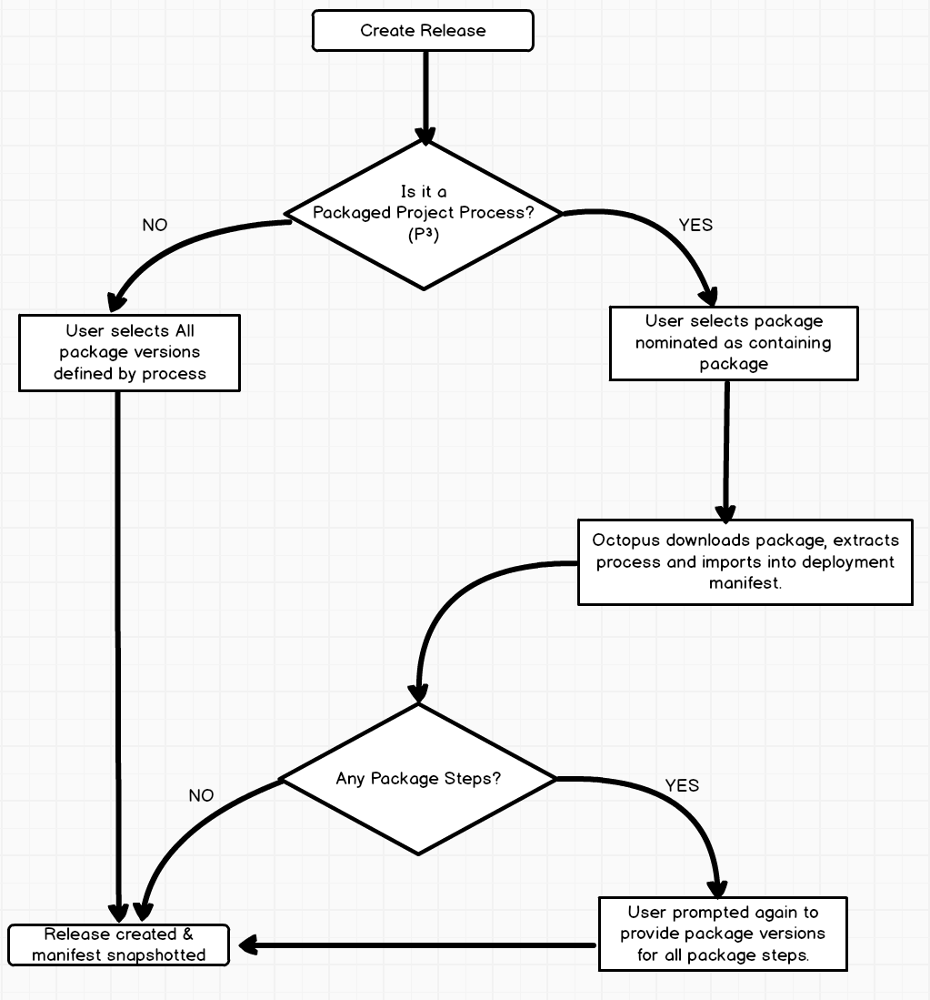

# Deployment Process As Code #

## Background ##
It's common practice to include configuration files that are used by various steps during the CI process. Terraform files, committed with a project can be tied to a specific build of a package to ensure that the infrastructure that is provisioned precisely fits the requirements of that particular build. A common request from users is the ability to commit the deployment configuration to source control. A previous proposal considered integrating source control (like git) into Octopus itself (lets call this the TeamCity approach). This might meet many of the required means however would lead to some complexities in dealing with and determining the correct deployment process. A solution closer to that of Terraform or Travis might provide a simpler solution of Octopus, while still meeting the user's needs.

## User Requests ##
[UserVoice #6186352 - Version Control of deployment scripts (431 votes)](https://octopusdeploy.uservoice.com/forums/170787-general/suggestions/6186352-version-control-of-deployment-scripts)

[UserVoice #15698781 - Version control configuration (430 votes)](https://octopusdeploy.uservoice.com/forums/170787-general/suggestions/15698781-version-control-configuration)

[UserVoice #13796499 - Connecting a source control repository for automated version control of configurations (1 vote)](https://octopusdeploy.uservoice.com/forums/170787-general/suggestions/13796499-connecting-a-source-control-repository-for-automat)

[UserVoice #32541541 - Deployment Pipeline as Code (3 votes)](https://octopusdeploy.uservoice.com/forums/170787-general/suggestions/32541541-deployment-pipeline-as-code)

## Design ##
A `octopus.json` file is included in the root of a package. This file can contain the full deployment process of a project and optionally some of the variables that are combined with the project variables.
 The project itself is configured to "Load the configuration from package" which bears some similarity to how a package can be used to determine the release version. The deployment process would essentially be blank since its not until a package is selected that the process is known by octopus. Any additional packages that are required to be determined need to be done in a two stage process. First the core package version is determined, the package is downloaded and the `octopus.json` file is extracted. Any additional package steps are determined and the user is then asked for these package versions before the release is created. Once the release is created is can be snapshotted (or not?) like any other deployment.

### This process would supplant using channels to reconfigure special deployment steps needed when a new version of the process is required while the old one is still in use due to an existing release still being under development.

### Setup ###
_User opts to import the deployment process from a package_

_The package that will contain the deployment process must be provided_

_The deployment screen now shows the master package details as well as allows for "viewing" the deployment process for a specific version_

### Creating a release ###

If creating a release through `octo.exe` the current approach of `octo.exe create-release --package=Acme:1.0.0` will still be used. The user needs to have some knowledge about which packages are relevant just as they are already expected to know. The Octopus Server internally will use the package that maps to the "process package" to download the process then any provided package details to populate the appropriate steps. This means this API should remain fairly unchanged.

## Limitations ##
Due to the dynamic nature of the deployment process, channel rules would likely be unable to be constructed since there is no way to tell what steps will be involved. Perhaps the configuration itself could provide similar rules for it's package steps directly?

## Further Steps ##
While this approach does not integrate the process directly into source control, this gap should be further bridged with the addition of GitHub as a package feed. In this scenario it would be plausible that users might have a repository purely for configuration, which is linked to the project in the manner described above, such that when a release is created the configuration is extracted from source control.

