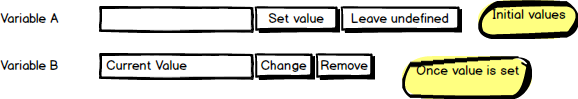

# Remote Release Promotions

This is the living specification for the _Remote Release Promotions_ feature.

This feature will allow promoting a Release between Spaces.

## Concepts

- Release Bundle: The promotion artifact. This will contain everything required to transport the release from one Octopus Space to another.   
- Deployment Receipt: A document representing the result of a deployment. This will be used to display the results of a remote deployment in the source Space. 

## Implementation

### Viewing the Deployment Process for a Release

In Octopus today, when you view a project's deployment process you are viewing the latest version.  There is no way to view the process that was snapshotted with a particular release.  

This has always been a gap.  Remote Promotions simply highlights it. 
For example, imagine a project has two Remote Environments: _Staging_ and _Production_.  And two releases have been promoted, a patch release (say `1.0.1`) into _Production_, and a feature release (`2.0`) into _Staging_.
If you were to view the deployment process for the project in the Remote Space, would it show the process as it was at `1.0.1` or `2.0`? 

We are proposing to implement viewing (read-only) the deployment process as it was at the time of the release. This will be useful even in non-remote-promotion scenarios, but will be critical for remote promotions. 

### Project variables are read-only on the remote space

Project variables will be snapshotted with the release (just as today), and will not be editable on the remote space.

To enable contributing environment-specific variables on the remote side, we will implement environment variable templates (see below).

### Environment Variable Templates

In Octopus today, variables can be scoped to environments.  If you forget to scope a value for an environment (e.g. if a new environment is added), there is no warning. The variable's value may silently fall back to a wider-scoped (or non-scoped) value. 

We feel this is unacceptable for Remote Promotions. 

The environments in the remote space may not even be known by the person responsible for maintaining a project's variables. Even if they are known, they are owned by the remote space: environments may be added or removed, and having to inform the upstream project teams each time this occurs feels like the direction for the dependency graph. 

To solve this, we are proposing extending the behaviour of [variable templates](https://octopus.com/docs/deploying-applications/variables/variable-templates).

Variable Templates were implemented specifically for multi-tenancy, to allow a project to declare the variables that each tenant must define. We will do the same for environments.  When you define a variable template you will be able to specify whether it is required to be defined per:

- tenant 
- environment
- tenant and environment (i.e. a value must be supplied for every tenant-environment combination)

When the release bundle is promoted to the remote space, this will allow Octopus to inform the user's in the remote space which environment and tenant specific variables must be supplied.

This should also address [this issue with template variables](https://github.com/OctopusDeploy/Issues/issues/2710).

### Explicit Null Variable Template Values

Customers have requested [optional variable templates](https://github.com/OctopusDeploy/Issues/issues/2709).

After considering it, our current thoughts are that templates are about preventing _accidental omission_ of variables. 

We are going to take the approach that it's OK to not supply a value, so long as the value is intentionally not supplied.

We can do this using a [null-object pattern](https://en.wikipedia.org/wiki/Null_Object_pattern), with a corresponding UI:

### Release channel is read-only on the remote space 

Viewing a project's channels suffers from the same issues as viewing the deployment process.  It is temporal. On the remote space we are interested only in the channel that the release was created for. This will be unable to be modified on the remote space.  

Variable scoping and deployment step scoping will occur when the bundle is created. 

The lifecycle on the remote side will be chosen at the time the release bundle is imported, removing the need for the channel to participate in that process.

### Project Triggers
Project triggers will be able to defined on either side (local or remote).

Triggers will not be included in the release bundle.

