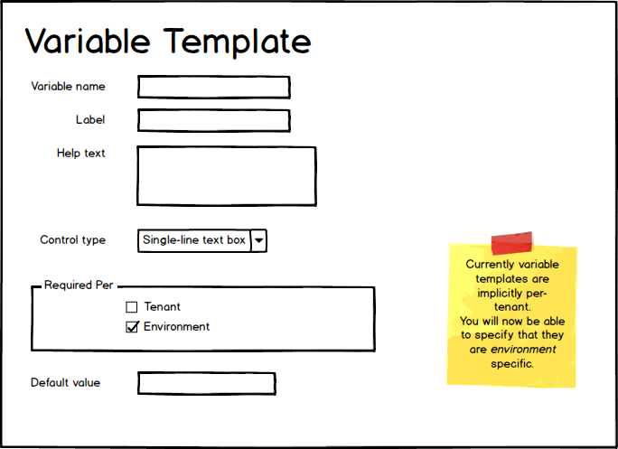

# Remote Release Promotions

This is the living specification for the _Remote Release Promotions_ feature.

This feature will allow promoting a Release between Spaces.

## Concepts

- Release Bundle: The promotion artifact. This will contain everything required to transport the release from one Octopus Space to another.   
- Deployment Receipt: A document representing the result of a deployment. This will be used to display the results of a remote deployment in the source Space. 

## Implementation

### Viewing the Deployment Process for a Release

In Octopus today, when you view a project's deployment process you are viewing the latest version.  There is no way to view the process that was snapshotted with a particular release.  

This has always been a gap.  Remote Promotions simply highlights it. 
For example, imagine a project has two Remote Environments: _Staging_ and _Production_.  And two releases have been promoted, a patch release (say `1.0.1`) into _Production_, and a feature release (`2.0`) into _Staging_.
If you were to view the deployment process for the project in the Remote Space, would it show the process as it was at `1.0.1` or `2.0`? 

We are proposing to implement viewing (read-only) the deployment process as it was at the time of the release. This will be useful even in non-remote-promotion scenarios, but will be critical for remote promotions. 

### Viewing variables for a release

As per [Viewing the Deployment for a Release](#view-release-deployment-process), we will allow viewing the variable values that were snapshotted with the release. 
And similarly, this will benefit everyone, not just those using Remote Promotions.

### Project variables are read-only on the remote space

Project variables will be snapshotted with the release (just as today), and will not be editable on the remote space.

To enable contributing environment-specific variables on the remote side, we will implement environment variable templates (see below).
 

### Environment Variable Templates

### Release channel is read-only on the remote space 

Viewing a project's channels suffers from the same issues as viewing the deployment process.  It is temporal. On the remote space we are interested only in the channel that the release was created for. This will be unable to be modified on the remote space.  

Variable scoping and deployment step scoping will occur when the bundle is created. 

The lifecycle on the remote side will be chosen at the time the release bundle is imported, removing the need for the channel to participate in that process.
