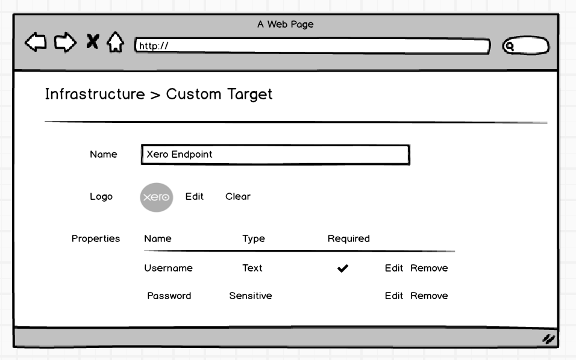
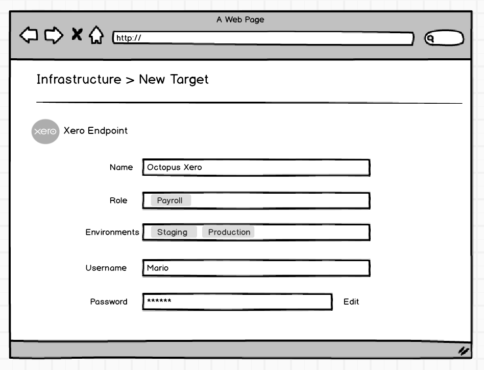
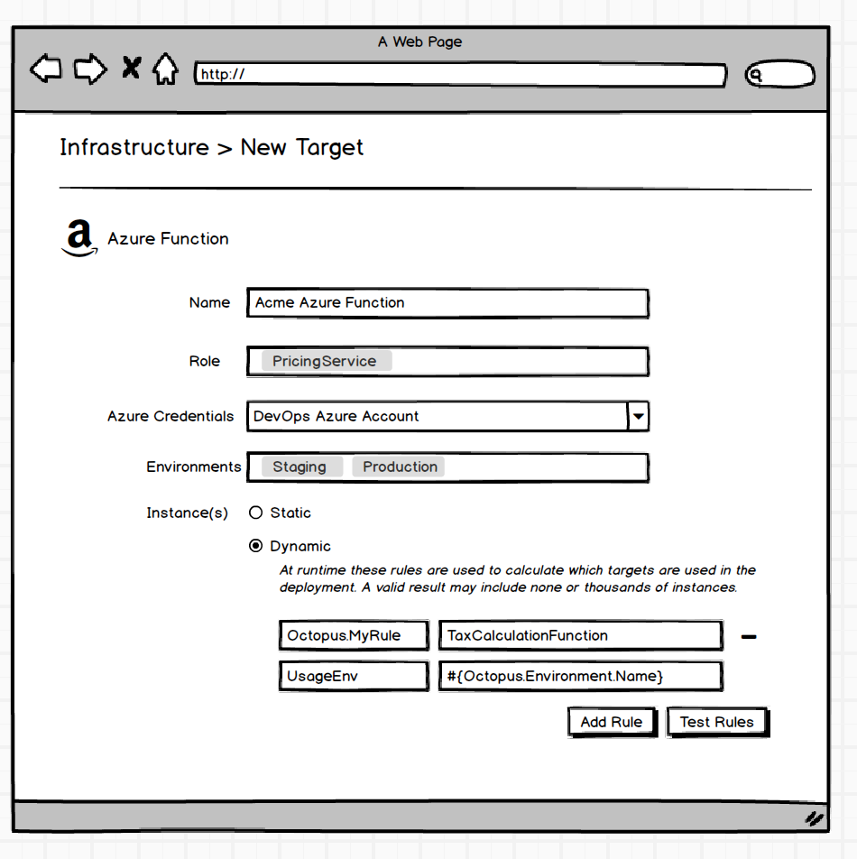
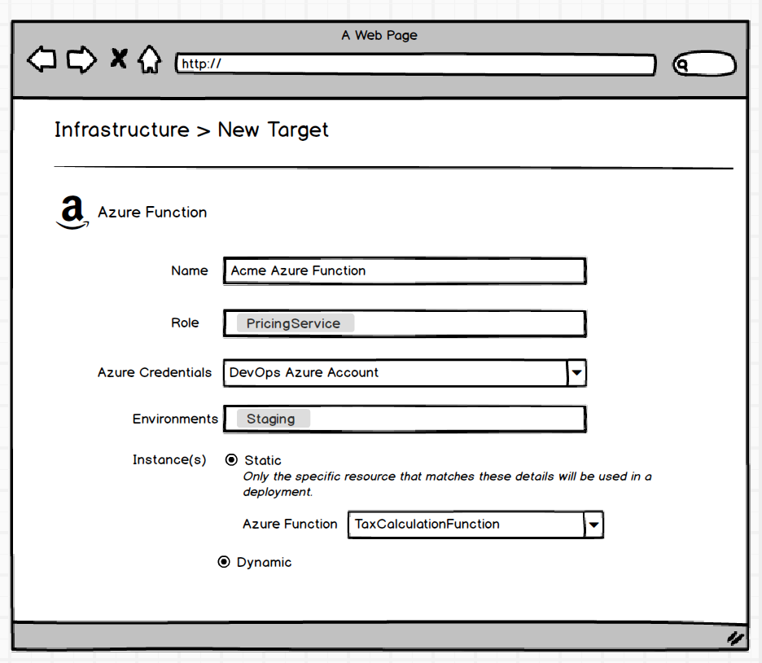
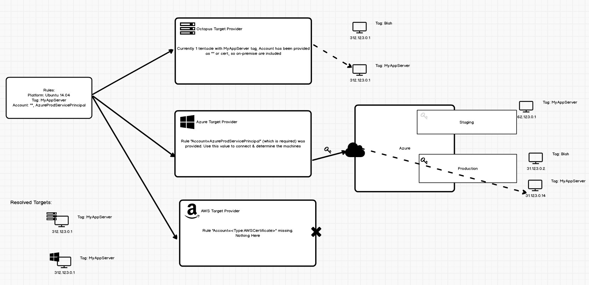
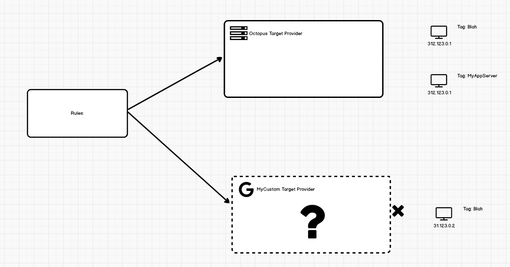

# Resources #
## To be renamed just "Targets" (Dynamic and Custom)
Replaces [Resources v1](./index.md)

#### One Liner
It's `3.0` version of Azure Targets but made to behave more like cattle by adding a dash of Cloud Regions.

#### Expanded Summary
_Disclaimer: Externally to users there are **now just `Targets`** (no resources). The terminology of the different types described here are just for internal discussion purposes to differentiate how they work. Don't get too caught up in terminology just yet._

`Custom Targets` can be defined, which specify properties (potentially `Typed Variables`) and icons and are used during deployments, typically for steps which require those properties for execution (e.g. a `Xero Target` may require a HTTP endpoint and some credentials and it used specifically by a `Xero Report` step). Think `Cloud Regions` but less generic and able to be user defined. Similar to a `Cloud Region`, a custom target by definition runs on the server (or worker) and can be iterated over if multiple exist in that environment.

A `Dynamic Target` is effectively a `Custom Target` that contains a rules that are used to derive the concrete instances. These instances are resolved through the appropriate `Target Provider` (e.g. Azure Target Provider uses target rules from Azure-defined Cloud Target) at runtime. In "Pet" mode the `Cloud Azure Target` can function like standard Custom Targets, where the specific azure resource can be selected via the UI rather than with rules. When these `Dynamic Targets` are resolved, they may resolve to multiple concrete instances (e.g. a rule on an Azure Cloud Service Target that includes all Cloud Services with the Azure Tag `BankingService`). When used in a deployment the default behavior may be to resolve _once_ and then provide the ability (similar to health check step, or perhaps properties on a step) to force the re-evaluation.

To Summarize:
* Externally users just think of targets as being the "Target of change of the action".
* **Machine Targets:** 
    * Run on some Octopus managed external location (Tentacle, SSH, Offline)
* **Custom Targets:** 
    * Run on the Worker. 
    * Just a bundle of properties which can be user defined. 
    * Can be iterated over in a deployment (much like Cloud Regions) and expose a higher level abstraction.
* **Dynamic Targets:** 
    * _Typically_ Run on the Worker (unless maybe they can also resolve through Octopus Target Provider into Tentacles?)
    * At runtime a Target Provider is consulted to determine the target details. 
    * This could be many or none.
    * User can optionally use rules or static configuration.

_Custom Target_

_Dynamic Target_

## Further Details ##
#### Evaluation ####
When a deployment is taking place and a step is about to run, Octopus needs to determine which targets are involved. To do this Octopus consults the target providers. Octopus provides the set of rules needed for the targets in question, and the providers evaluate, based on its current knowledge (which means consulting Cloud API endpoints) which targets are relevant and provides the additional information needed to perform the deployment, like IP addresses, names etc.

_A rule with some credentials have been provided which match the requirements of the Azure Target Provider so it queries the Azure API, which due to the credentials happen to be the Production subscription._

The resolvers themselves should be treated as pluggable components, so that we (or others) can provide additional resolvers for other providers.

_An additional target prover for some new cloud provider can be built in the future and easily added to existing Octopus server instances without requiring a full upgrade_

### Tags in the world ###
A key point here is that the tag _values_ typically exist out in the world itself and not on some internal representation kept by Octopus. When dealing with cloud-based targets it is expected that the user will apply the relevant tags using the standard [Azure](https://docs.microsoft.com/en-us/azure/azure-resource-manager/resource-group-using-tags) or [AWS](https://aws.amazon.com/answers/account-management/aws-tagging-strategies/) tagging mechanisms. These tags are what is read by the Target Provider. Additional properties about the target will also be retrieved automatically by the provider for use in the deployment as first class variables, e.g IP Addresses for the Azure Web App to be used in DNS reconfiguration. Service messages during a deployment process (or maintenance task) are able to be "put onto" the target by Octopus to allow for more complex scenarios.