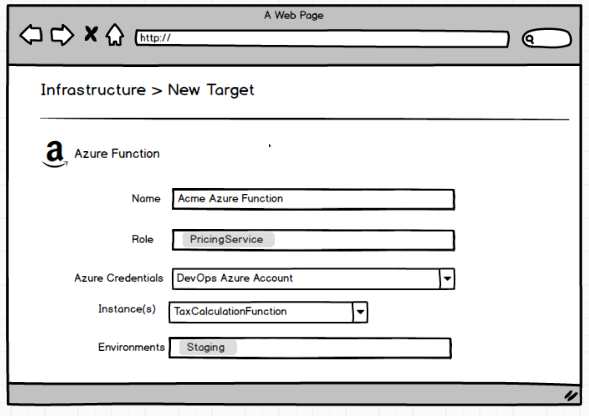

# Cloud Targets #
Replaces [Resources v2](./Resources_v2.md)

#### One Liner
A `Cloud Targets` effectively takes us back to a solution shaped very much like the Azure targets in 3.0. With the introduction of [environment templates](../EnvironmentTemplates/index.md) some of the concerns around dealing with dynamically provisioned architecture should be solved when Octopus infrastructure can be configured on-the-fly without having to rely on cloud regions with variables.

Cloud Target_

At deployment time the standard role checks take place to determine which relevant cloud targets are required for specific steps. If the target is unable to be used by a step

Additional properties about the target will also be retrieved automatically by the provider for use in the deployment as first class variables, e.g IP Addresses for the Azure Web App to be used in DNS reconfiguration. Service messages during a deployment process (or maintenance task) are able to be "put onto" the target by Octopus to allow for more complex scenarios.
