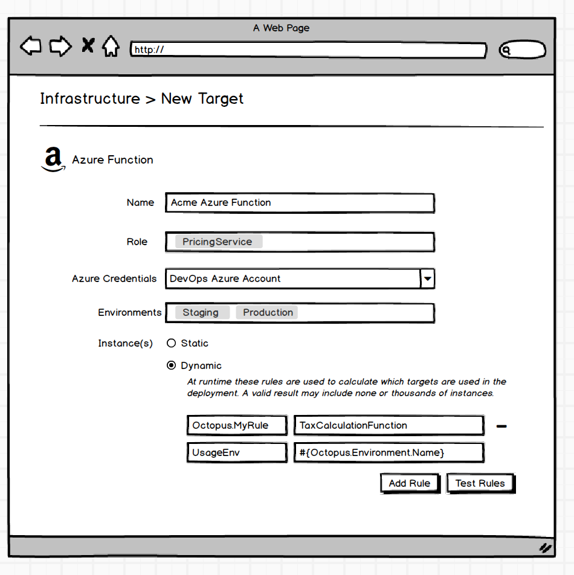

# Resources #
## To be renamed just "Targets" (Dynamic and Custom)
Replaces [Resources v2](./Resources_v2.md)

#### One Liner
It's `3.0` version of Azure Targets but made to behave more like cattle by adding a dash of Cloud Regions.

#### Expanded Summary
_Disclaimer: Externally to users there are **now just `Targets`** (no resources). The terminology of the different types described here are just for internal discussion purposes to differentiate how they work. Don't get too caught up in terminology just yet._

A `Cloud Targets` effectively takes us back to a solution shaped very much like the Azure targets in 3.0.

_Dynamic Target_

Additional properties about the target will also be retrieved automatically by the provider for use in the deployment as first class variables, e.g IP Addresses for the Azure Web App to be used in DNS reconfiguration. Service messages during a deployment process (or maintenance task) are able to be "put onto" the target by Octopus to allow for more complex scenarios.
