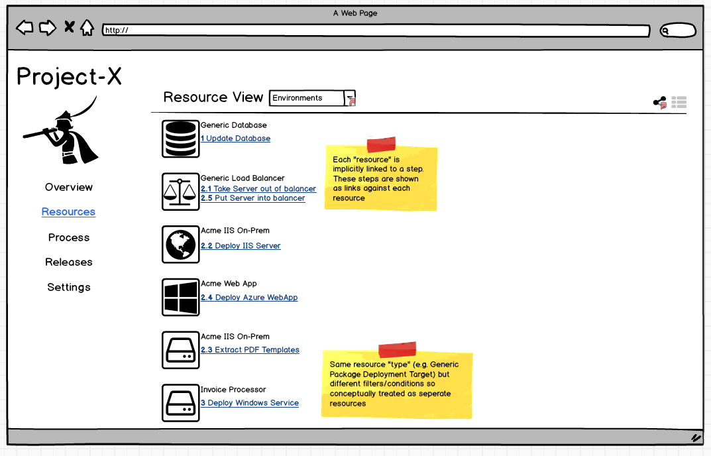
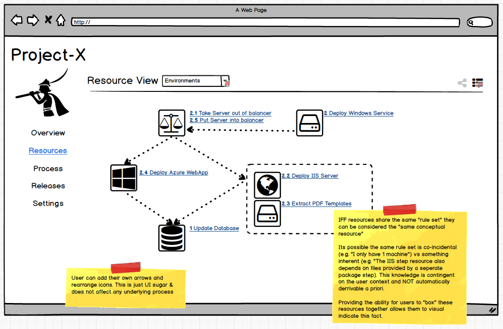
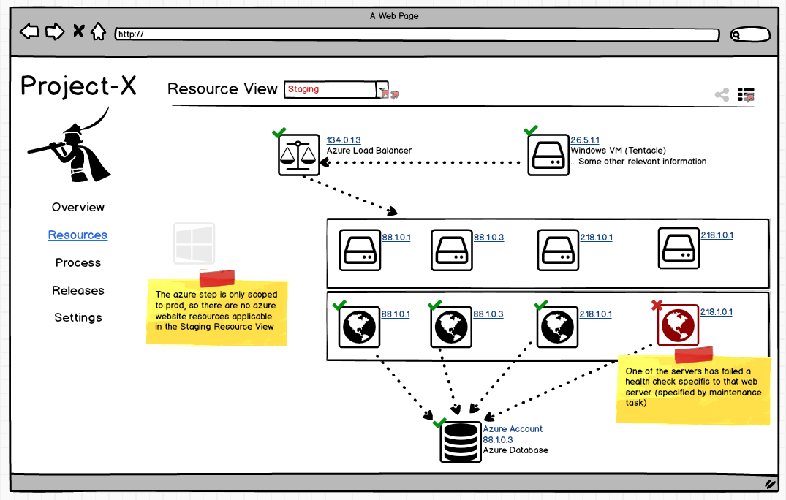
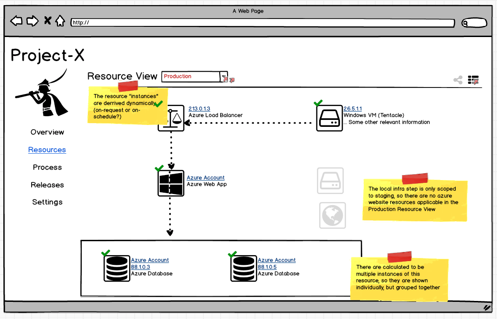
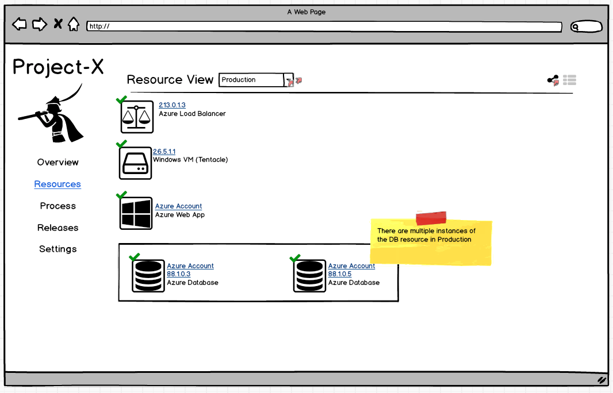

# [Resources](index.md) #
## Holistic App View ##
Since all actions describe an action on a resource(s), we can therefor provide a simple view of all the resources for a given project.

Since a single resource may be used across multiple steps, this view allows you to see a consolidated list of the pieces that make up the given application. 

Using purely "UI sugar" the user may be able to rearrange these resources into a graph view to see how the dependencies all relate. This arrangement and connections have no influence on the deployment and only serve to allow the user to provide context to their list or resources in a way that can only be determined by someone who knows the system. There is no deterministic way for Octopus to decide what this graph looks like.

The real kicker is when these environment-agnostic views are switched to look at the world for a specific environment. Just as the resource definiton acts as an abstract view at a real instance of something in the real world, the abstract list of resources can be configured to be seen through a prism that reflects the real state of the world.

Since environments exist on a space level, these view may even be able to be exposed at the space level, allowing the user to see how the same resource is used across projects or even how individual project resources are related/shared with one another.

_These views would also be available in the simple list format._

Notice a few interesting points with these screens. First, is that although we only defined one database through the abstract resource definition, when the rules are applied through the target provider, it was determined that there are actually two databases out there in the world for production that would be deployed to if a deployment ran right now.
Similarly in staging we have determined that there are multiple IIS web servers that would match the rule however one of them is failing a health check so the user can either manually redeploy, or rely on some trigger firing off a maintenance process to take it out of the load balancer.

If viewing this screen during a deployment, you might even see resources flash as their corresponding actions are running, and go to ticks or crosses as the deployment runs. The user would then be able to see a graphical representation on the effects of the deployment to their application.

This view opens up the door to rubbing more dev ops into Octopus by going from the process-centric view of the world that is the old projects, to a status-centric view of the world. A space level view the resources would serve as a great dashboard into the current state of the world. Not only that but as a developer, how many times have you started in a new job and spent the first day just trying to get a grips with how the new system works and interacts with all its infrastructure dependencies. As a new starter, these graphs would serve as a great way to understand the application from a holistic birds eye view rather than trying to mentally parse different project steps and what that impacts based on the roles.