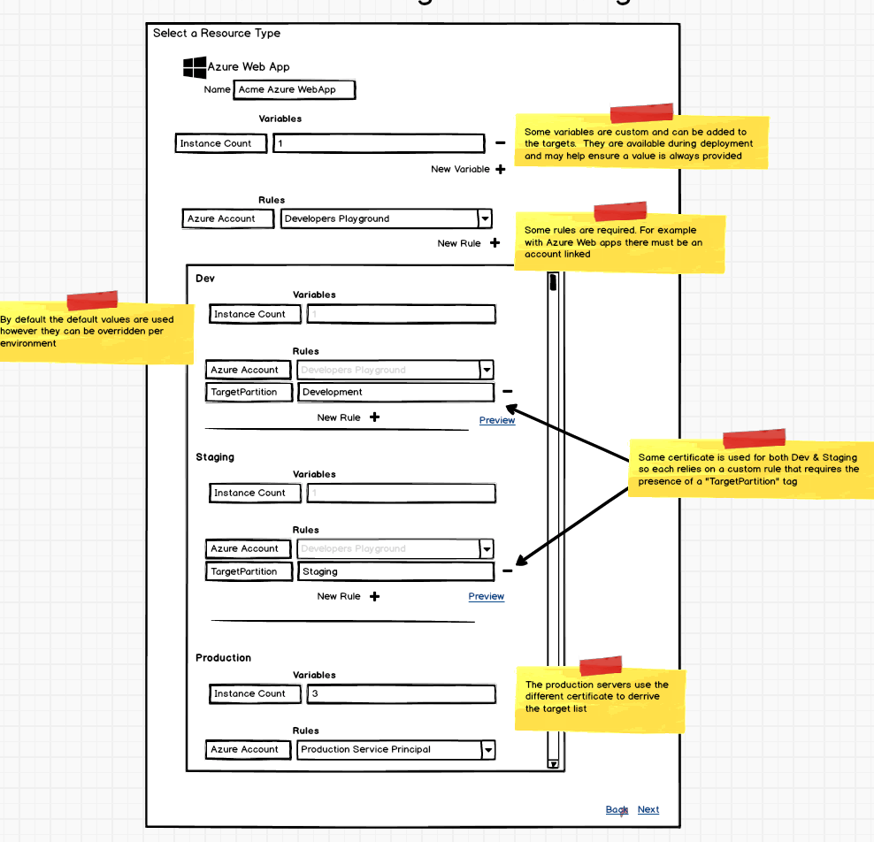
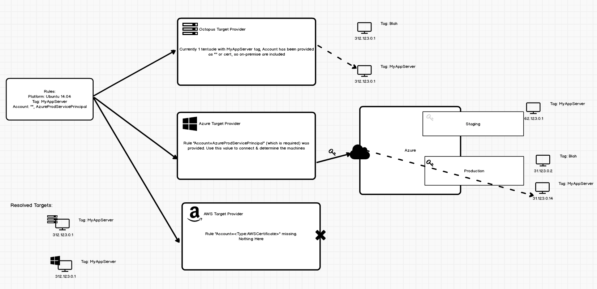
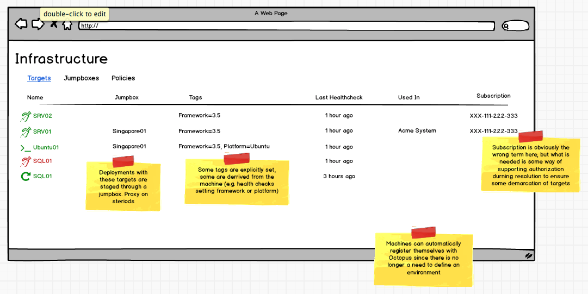
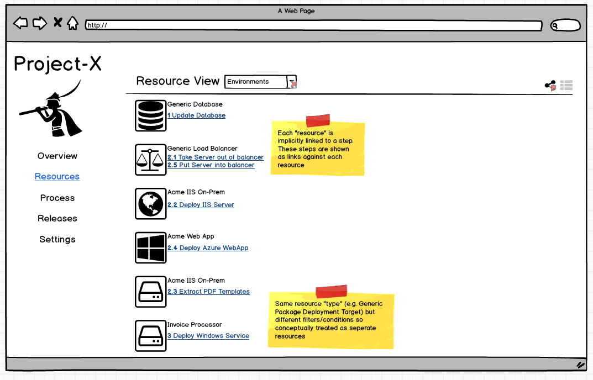
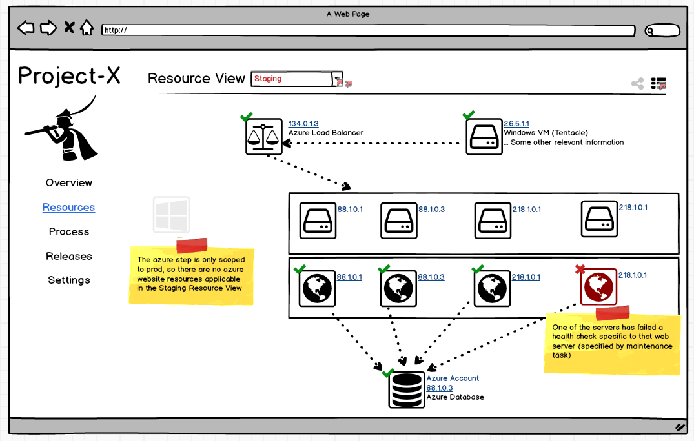
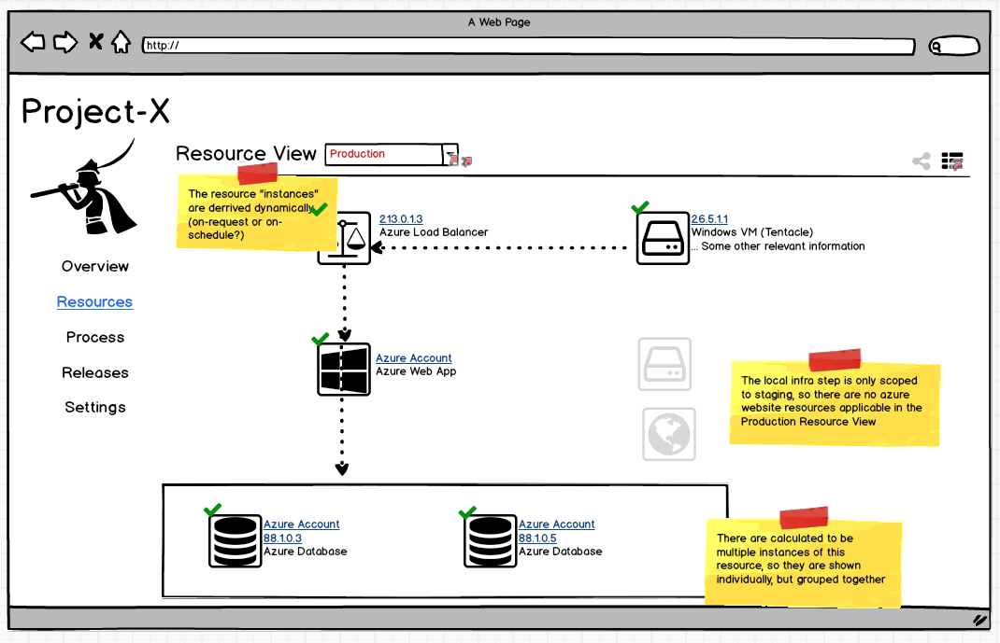
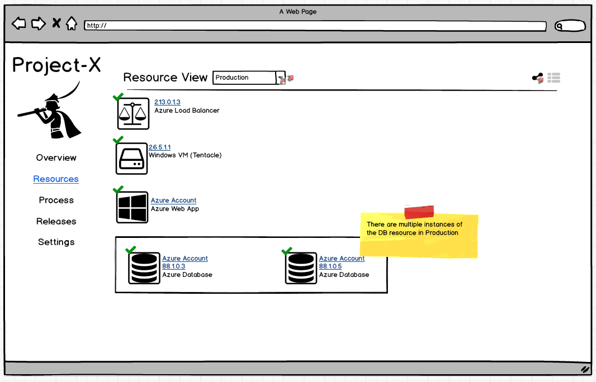

# Resources #
As Octopus looks to better support  a cloud-first approach, the way in which we view the relationship between tentacles and deployments needs to change.

There are a points to this new concept in Octopus.
- Actions run against resources
- Some actions require resources that match a specific interface\shape. e.g. Azure steps require resources that include accounts but an "Deploy a package" step just requires somewhere that packages can be extracted to.
- Resources are defined using a set of rules
- Resource definitions feature a form of inheritance or decorators. E.g. All IIS steps require the IIS Resource, but the IIS Resource can also be used for `Run A Script` steps which just requires the ability to run scripts.
- The rules that define a resource are evaluated at deployment time before each step runs. 
- Target roles become tags. These tags mimic Azure or AWS tags.
- On-Prem resources and permissions

## Actions Use a Resource ##
When defining a package deployment action, the target is defined by one (or more) `roles`. When defining an azure deployment, the target is defined using `Azure Credentials` along with potentially a `Web App Name` (for deploying web apps), `Storage Account` (for deploying cloud services) or any other number of properties which are more about defining _Where_ you want the deployment to take place as opposed to the _How_ (which more closely corresponds to the variables, configuration, scripts or Calamari conventions of the action). As a user of Octopus, it would be great to be able to treat the _Where_ in a way that better fits a dynamic world where machines (or external items) may come and go on the fly.

By looking at deployments in this way we can see that a deployment, as described above, can be seen as utilizing a bunch of resources to perform some task. Defining these resources outside of the step itself will make it easier to define the properties that change between environments, as well as providing a first class way of representing to the user their presence instead of through some combination of arbitrary properties in a step.

## Resource Rules ##
#### Defining Rules #####
A resource is conceptually just an abstract representation of some target, or thing in the world where a deployment will take place. At the moment I dont see things like Accounts or Certificates as being resources but merely typed variables, of which resources are to some extent however resources play a slightly bigger role in a deployment.

A resource is described with a set of rules. These rules can be specific for an environment or required when used in any.


In the above example, we have specified that any deployment that involves `Self-Hosted IIS Server` resource requires the instance to include a tag called `Role` with a value of `IISAcme`. In addition to this tag we have also defined that for a machine to be included, it needs to include a tag name `Framework` that has a value `.NET3.5` _or_ `.NETCORE1.0`. This opens the door for later hooking into machine capabilities. An additional tag is required in production called `SpecialPerm` that has a value that provides some mechanism for security around machines and environments. This mirrors what we would do with account subscriptions in cloud providers. 



For the Azure resource type, the `Azure Account` rule is required to be provided. By default the `Developer Playground` account is provided except for under production where a different account is used. Since we are using a shared account for Dev and Staging, an additional tag is used to differentiate between the resources. These might be set during the environment provisioning.

#### Evaluation ####
When a deployment is taking place and a step is about to run, Octopus needs to determine which resources are involved. To do this Octopus consults the target providers. This may involve just the engine that resolves "local" Octopus infrastructure, or it may be ones specifically tailored to resolve resources in some external infrastructure system like AWS or Azure. Octopus provides the set of rules needed for the resource in question, and the providers evaluate, based on its current knowledge (which means consulting Cloud API endpoints) which resources are relevant and provides the additional information needed to perform the deployment, like IP addresses, names etc.
This way the on-prem, Octopus-managed pet tentacles an be treated in the exact same way as the cloud-cattle. Note that these providers require Octopus to maintain a set of credentials for the external cloud service so that their API can be queried.


_The Azure & AWS target providers both require additional credential information provided from the rule itself so they are not even queried_


_A rule with some credentials have been provided which match the requirements of the Azure Target Provider so it queries the Azure API, which due to the credentials happen to be the Production subscription._

The resolvers themselves should be treated as pluggable components, so that we (or others) can provide additional resolvers for other providers.


_An additional target prover for some new cloud provider can be built in the future and easily added to existing Octopus server instances without requiring a full upgrade_

### Allowing Pets to be pets ###



## Holistic App View ##
Since all actions describe an action on a resource(s), we can therefor provide a simple view of all the resources for a given project.



Since a single resource may be used across multiple steps, this view allows you to see a consolidated list of the pieces that make up the given application. 

Using purely "UI sugar" the user may be able to rearrange these resources into a graph view to see how the dependencies all relate. This arrangement and connections have no influence on the deployment and only serve to allow the user to provide context to their list or resources in a way that can only be determined by someone who knows the system. There is no deterministic way for Octopus to decide what this graph looks like.


The real kicker is when these environment-agnostic views are switched to look at the world for a specific environment. Just as the resource definiton acts as an abstract view at a real instance of something in the real world, the abstract list of resources can be configured to be seen through a prism that reflects the real state of the world.

Since environments exist on a space level, these view may even be able to be exposed at the space level, allowing the user to see how the same resource is used across projects or even how individual project resources are related/shared with one another.




_These views would also be available in the simple list format._


Notice a few interesting points with these screens. First, is that although we only defined one database through the abstract resource definition, when the rules are applied through the target provider, it was determined that there are actually two databases out there in the world for production that would be deployed to if a deployment ran right now.
Similarly in staging we have determined that there are multiple IIS web servers that would match the rule however one of them is failing a health check so the user can either manually redeploy, or rely on some trigger firing off a maintenance process to take it out of the load balancer.

If viewing this screen during a deployment, you might even see resources flash as their corresponding actions are running, and go to ticks or crosses as the deployment runs. The user would then be able to see a graphical representation on the effects of the deployment to their application.

This view opens up the door to rubbing more dev ops into Octopus by going from the process-centric view of the world that is the old projects, to a status-centric view of the world. A space level view the resources would serve as a great dashboard into the current state of the world. Not only that but as a developer, how many times have you started in a new job and spent the first day just trying to get a grips with how the new system works and interacts with all its infrastructure dependencies. As a new starter, these graphs would serve as a great way to understand the application from a holistic birds eye view rather than trying to mentally parse different project steps and what that impacts based on the roles.

## Resource Health Checks ##
Currently in octopus, the health checks are very hardware focused. The health of a target is more about connectivity and availability for deployment. Looking at a target through the eyes of the infrastructure team this makes sense. On the target view there is no concept of project or resource since the global view lacks the context. Additionally, when a machine is shared across projects, what constitutes a health alert for one project, might not be relevant for another (e.g. an IIS website no longer responding to HTTP requests but the installed windows service is still running fine). For this reason even asking the user to leverage custom health checks isn't really the right fit. What the user really is after is a health check _of the resource_ not the machine.

Leveraging maintenance tasks that run once a minute, the user may want to ping a specific HTTP endpoint and require a 200 response in under 2 seconds. If this does not occur, they want the IIS resource to be considered unhealthy. When this occurs an event is fired off that may trigger another maintenance task that takes it out of the load balancer, or perhaps performs a redeploy. 

Perhaps during a rolling deployment the newly deployed projects hit 100% CPU after running for one minute so stop the deploy and redeploy the previous release.

The goal is to allow users to use Octopus to be proactive about dealing with application issues that is as automated as possible, coupled with the resource views described above this would provide a nice insight into the progress and status of your deployed application.

One of the simplest ways that this might be approached is by parsing a new service message from task logs. for example, we may read
```
##octopus[health target=#{Octopus.Target} status="Unhealthy" message="No 200"]
```
and interpret that as a signal to flag the resource as unhealthy. This tagging would likely involve talking through the target provider since for cloud resources that would involve setting a tag directly onto the [Azure](https://docs.microsoft.com/en-us/azure/azure-resource-manager/resource-group-using-tags) or [AWS](https://aws.amazon.com/answers/account-management/aws-tagging-strategies/) resources themselves. We always want to rely on the real world _where possible_ to determine the state of the world.

This service message could come through at any time and may be used in a maintenance task (since these are treated just like any "run a script" type task) or even during a deployment itself.

If it makes sense then it may even be valid to leverage these service messages for target-level health checks instead of just parsing exit codes as is done currently.

One thing worth noting here is that these health checks are not intended to replace logging or monitoring systems. In the future we may allow mechanisms to plug these live data streams directly into Octopus in some first class manner, so that users can trigger the actions based on rules around things like SEQ logging (e.g. 5 critical logs in the last 5 minutes) or Azure performance counters.

## Migration ##