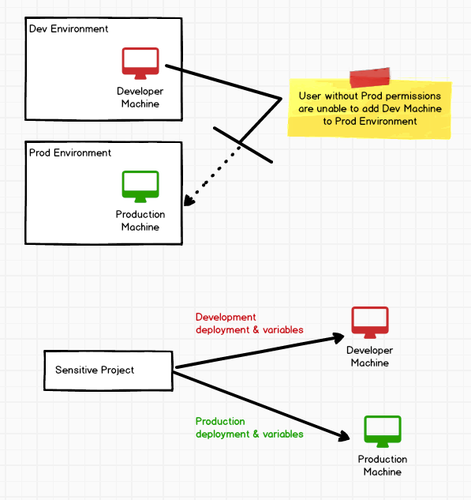
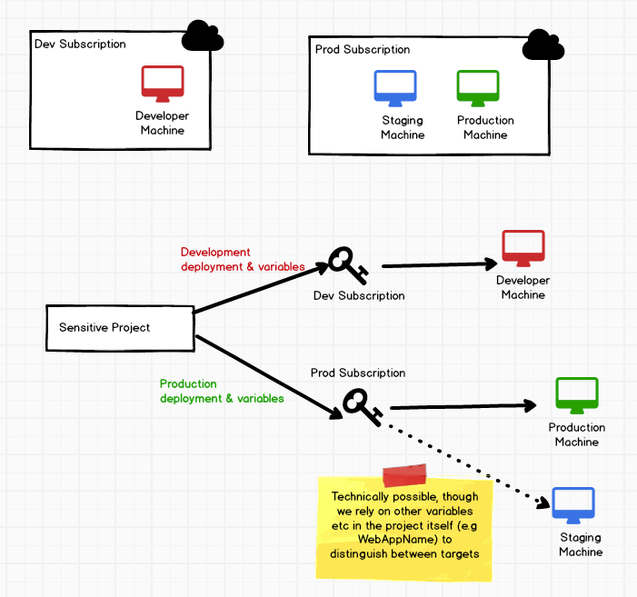

# [Resources](index.md) #
## Permissions/Auth ##

#### What security are we talking about? ###
In current (4.0) Octopus Deploy, there is some layer of protection preventing deployments intended for production (where there may be a secure environment) from "accidentally" being deployed on to a development-intended machine where security may be more lax. This may be important when secure passwords, etc only intended for use in a production environment, suddenly has the ability of leaking into an insecure environment. 

#### Current approach ###
For standard on-premise targets, this is accomplished by ensuring only users who have `MachineEdit` access and `EnvironmentView` for the environment in question can add a machine to the given that environment. When a deployment takes place for production, then the machines themselves indicate what environment they can be used for. 

Alternatively for cloud targets users typically use subscriptions (or some other cloud-specific account) as the security boundary between resources. In Octopus we then use this account for accessing the relevant resources. In this view, if I have two Azure Web Apps, one under Staging and the other under Production, but existing in the same Azure Subscription, this is a different sort of security concern. From the Octopus point of view if a user has access to the shared subscription then they have access to both instances. The ability to only deploy to the Production machine and not Staging machine for a given deployment is then based on other variables we supply during the deployment like WebAppName etc.

#### Approach with resources ####
...