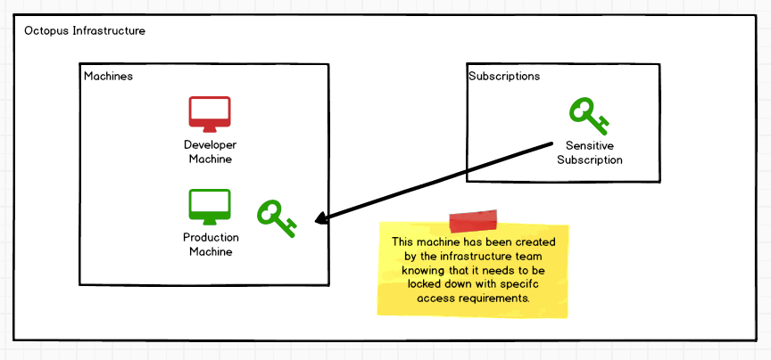
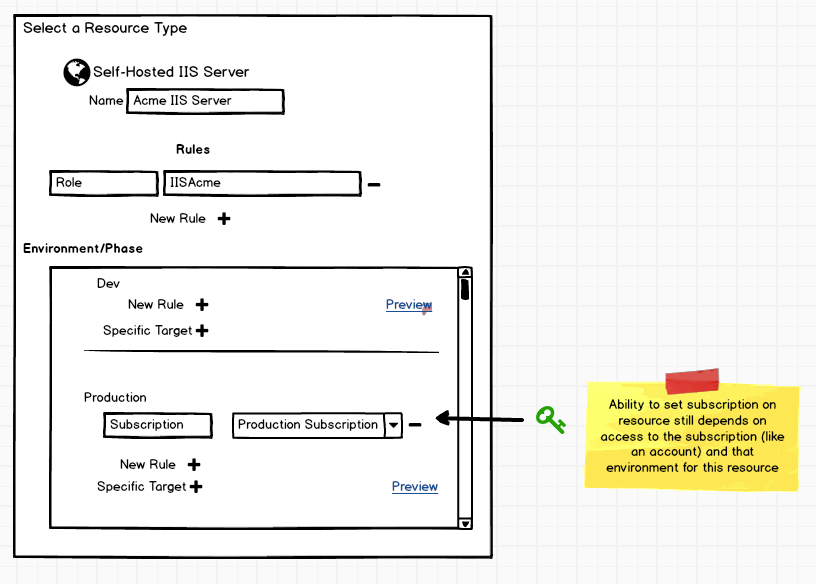
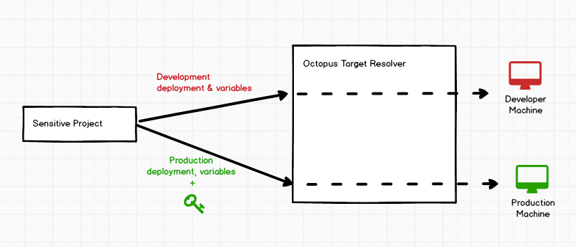

# [Resources](index.md) #
## Permissions/Auth ##

There are two competing concerns when it comes to permissions and resources.
- Allowing anyone who needs to configure a project deployment process to have access to add/edit resources with minimal-to-no additional specific roles.
- Provide some level of security to allow configuration of resource with (for example) sensitive environment rules that can only be modified by users with sufficient permissions.

### Configuring Resources ###

### Maintaining Infrastructure Security ##
In current (4.0) Octopus Deploy, there is some layer of protection preventing deployments intended for production (where there may be a secure environment) from "accidentally" being deployed on to a development-intended machine where security may be more lax. This may be important when secure passwords, etc only intended for use in a production environment, suddenly has the ability of leaking into an insecure environment. 

#### Current approach ###
For standard on-premise targets, this is accomplished by ensuring only users who have `MachineEdit` access and `EnvironmentView` for the environment in question can add a machine to the given that environment. When a deployment takes place for production, then the machines themselves indicate what environment they can be used for. 

Alternatively for cloud targets users typically use subscriptions (or some other cloud-specific account) as the security boundary between resources. In Octopus we then use this account for accessing the relevant resources. In this view, if I have two Azure Web Apps, one under Staging and the other under Production, but existing in the same Azure Subscription, this is a different sort of security concern. From the Octopus point of view if a user has access to the shared subscription then they have access to both instances. Using a given subscription key (or keys) in a deployment, requires both `AccountView` for the account that has been configured with that environment, and the `VariableEdit` view permissions for that project, again within the context of the given environment. The ability to only deploy to the Production machine and not Staging machine for a given deployment is then based on other variables we supply during the deployment like WebAppName etc.

#### Proposal with resources ####
The cloud based solution where security is relies on the appropriate account being provided during deployment feels like it might be a nice approach to mimic in the Octopus on-prem world. Particularly when we start looking at managing the on-prem infrastructure itself as functional area of its own.

In the infrastructure area (outside any spaces) machines are connected to Octopus and some may have a piece of information attached identifying them as sensitive targets. In this example we are calling it a subscription. 

There is nothing cryptographic about this information, it only serves to provide a mechanism to allow only certain users\teams access to use it, in much the same way we do today with accounts. In many ways this is like a custom "Octopus Account" type however due to its responsibility it lives in the global level. (or does it....?)

When configuring a resource, this subscription item can be applied to any or all environments, again in much the same way that accounts can be set for cloud-based resources. Perhaps this account property of a resource can be escalated as a first class property that all resources can optionally have, with the relevant account types used depending on the resource\step.

When target resolution takes place, the subscription key is passed through into the Octopus Target Resolver, once again just like an account in cloud scenarios is provided to the cloud target provider). 

