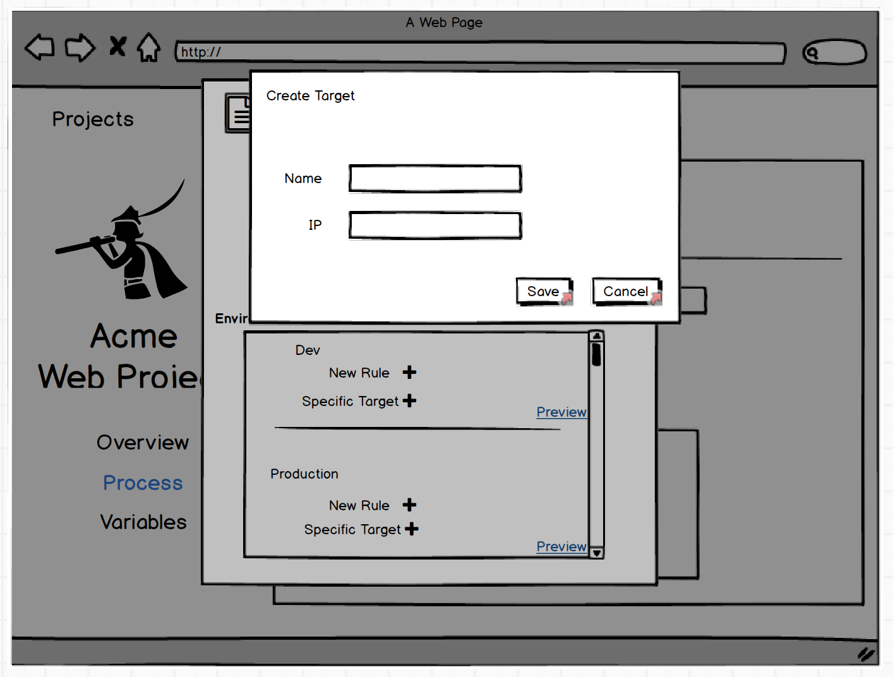

# [Resources](index.md) #
## Keeping Pets Pets ##
While the changes proposed as a part of these resources spec documents should improve the abilities of users to go "cloud-first", we need to ensure that the user flow for those still treating their targets as pets is as smooth as it is today since these users still make up the bulk of our customers.

### Adding New Target To Process ###

### ... more details to come ... ###