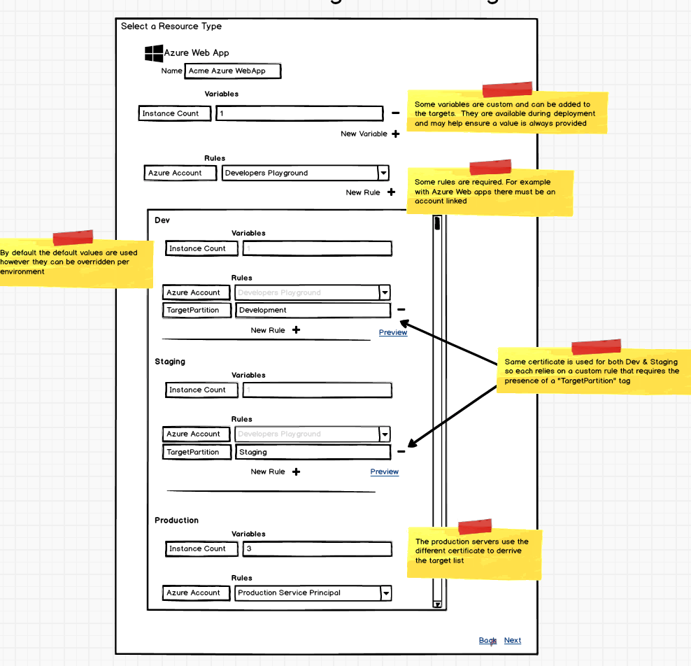

# Resources #
## Resource Definitions ##
Some actions require resources that match a specific interface\shape. e.g. Azure steps require resources that include accounts but an "Deploy a package" step just requires somewhere that packages can be extracted to. So each step defines what resource is required. 

A resource definition may be built-in to Octopus, or provided via the step extension package (at some later point). This definition would include 
- The name
- A list of any required rules (e.g. the base AWS resource may require an AWS credential to always be provided) 
- A reference to any other resources that it extends (e.g. the AWS S3 resource may extend the AWS resource to includes the AWS credential requirements) 
- An icon

Each step then references the resource required for its execution. Since resource definitions feature a form of inheritance or decorators, you can use a resource, with rules provided from another step, in a step that just requires the supertype.

When looking at the [resource rules](resource_rules.md) for a given resource type, you can see how the Azure resources require the presence of a specific account type which can be hard-coded to a specific value, differ between environments or use use variable substitution to resolve to a value. Accounts, Certificates and other similar entities in Octopus can be considered as `typed-variables` to make selection and configuration as simple and safe as possible.
