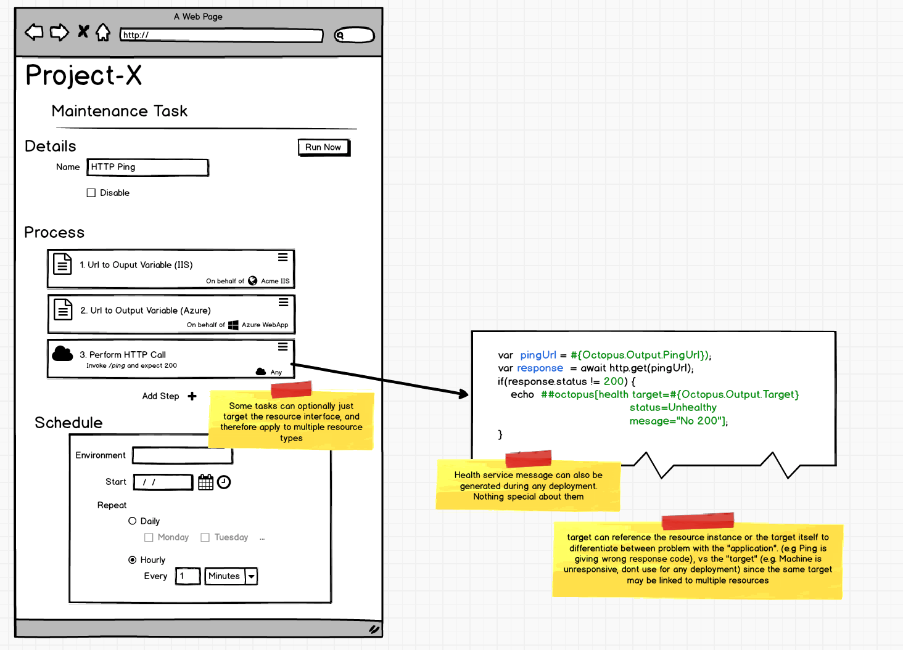

# Resources #
## Resource Health Checks ##
Currently in octopus, the health checks are very hardware focused. The health of a target is more about connectivity and availability for deployment. Looking at a target through the eyes of the infrastructure team this makes sense. On the target view there is no concept of project or resource since the global view lacks the context. Additionally, when a machine is shared across projects, what constitutes a health alert for one project, might not be relevant for another (e.g. an IIS website no longer responding to HTTP requests but the installed windows service is still running fine). For this reason even asking the user to leverage custom health checks isn't really the right fit. What the user really is after is a health check _of the resource_ not the machine.

Leveraging maintenance tasks that run once a minute, the user may want to ping a specific HTTP endpoint and require a 200 response in under 2 seconds. If this does not occur, they want the IIS resource to be considered unhealthy. When this occurs an event is fired off that may trigger another maintenance task that takes it out of the load balancer, or perhaps performs a redeploy. 

Perhaps during a rolling deployment the newly deployed projects hit 100% CPU after running for one minute so stop the deploy and redeploy the previous release.

The goal is to allow users to use Octopus to be proactive about dealing with application issues that is as automated as possible, coupled with the resource views described above this would provide a nice insight into the progress and status of your deployed application.

One of the simplest ways that this might be approached is by parsing a new service message from task logs. for example, we may read
```
##octopus[health target=#{Octopus.Target} status="Unhealthy" message="No 200"]
```
and interpret that as a signal to flag the resource as unhealthy. As noted previously this tagging would likely involve talking through the target provider since for cloud resources that would involve setting a tag directly onto the [Azure](https://docs.microsoft.com/en-us/azure/azure-resource-manager/resource-group-using-tags) or [AWS](https://aws.amazon.com/answers/account-management/aws-tagging-strategies/) resources themselves. We always want to rely on the real world _where possible_ to determine the state of the world.

This service message could come through at any time and may be used in a maintenance task (since these are treated just like any "run a script" type task) or even during a deployment itself.

If it makes sense then it may even be valid to leverage these service messages for target-level health checks instead of just parsing exit codes as is done currently.

One thing worth noting here is that these health checks are not intended to replace logging or monitoring systems. In the future we may allow mechanisms to plug these live data streams directly into Octopus in some first class manner, so that users can trigger the actions based on rules around things like SEQ logging (e.g. 5 critical logs in the last 5 minutes) or Azure performance counters.

This feature isn't necessarily required as a part of resources from day 1, but would be a nice to have.