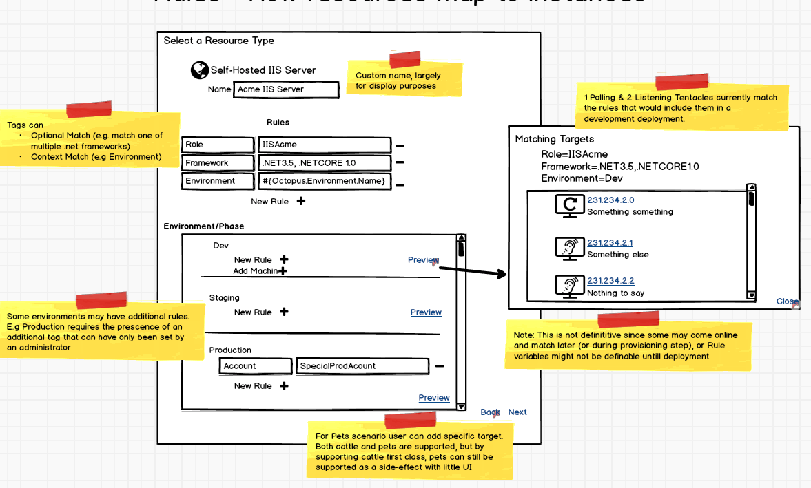
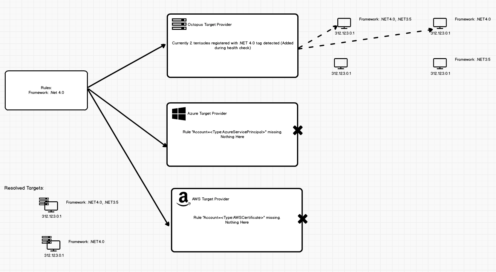
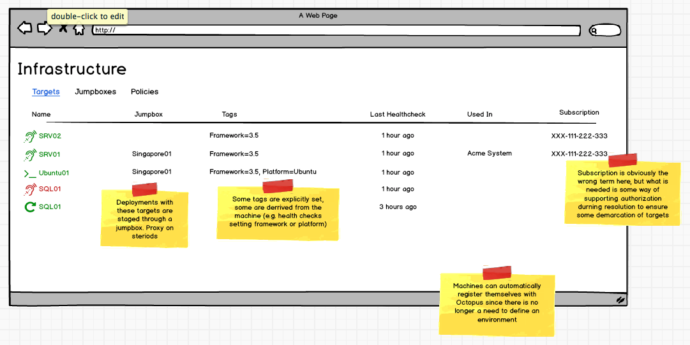

# [Resources](index.md) #
## Resource Rules ##
#### Defining Rules #####
A resource is conceptually just an abstract representation of some target, or thing in the world where a deployment will take place. At the moment I dont see things like Accounts or Certificates as being resources but merely typed variables, of which resources are to some extent however resources play a slightly bigger role in a deployment.

A resource is described with a set of rules. These rules can be specific for an environment or required when used in any.

In the above example, we have specified that any deployment that involves `Self-Hosted IIS Server` resource requires the instance to include a tag called `Role` with a value of `IISAcme`. In addition to this tag we have also defined that for a machine to be included, it needs to include a tag name `Framework` that has a value `.NET3.5` _or_ `.NETCORE1.0`. This opens the door for later hooking into machine capabilities. An additional tag is required in production called `SpecialPerm` that has a value that provides some mechanism for security around machines and environments. This mirrors what we would do with account subscriptions in cloud providers. 

For the Azure resource type, the `Azure Account` rule is required to be provided. By default the `Developer Playground` account is provided except for under production where a different account is used. Since we are using a shared account for Dev and Staging, an additional tag is used to differentiate between the resources. These might be set during the environment provisioning.

#### Evaluation ####
When a deployment is taking place and a step is about to run, Octopus needs to determine which resources are involved. To do this Octopus consults the target providers. This may involve just the engine that resolves "local" Octopus infrastructure, or it may be ones specifically tailored to resolve resources in some external infrastructure system like AWS or Azure. Octopus provides the set of rules needed for the resource in question, and the providers evaluate, based on its current knowledge (which means consulting Cloud API endpoints) which resources are relevant and provides the additional information needed to perform the deployment, like IP addresses, names etc.

This way the on-prem, Octopus-managed pet tentacles an be treated in the exact same way as the cloud-cattle. Note that these providers require Octopus to maintain a set of credentials for the external cloud service so that their API can be queried.

_The Azure & AWS target providers both require additional credential information provided from the rule itself so they are not even queried_

_A rule with some credentials have been provided which match the requirements of the Azure Target Provider so it queries the Azure API, which due to the credentials happen to be the Production subscription._

The resolvers themselves should be treated as pluggable components, so that we (or others) can provide additional resolvers for other providers.

_An additional target prover for some new cloud provider can be built in the future and easily added to existing Octopus server instances without requiring a full upgrade_

### Tags in the world ###
A key point here is that the tag _values_ typically exist out in the world itself and not on some internal representation kept by Octopus. When dealing with cloud-based resources it is expected that the user will apply the relevant tags using the standard [Azure](https://docs.microsoft.com/en-us/azure/azure-resource-manager/resource-group-using-tags) or [AWS](https://aws.amazon.com/answers/account-management/aws-tagging-strategies/) tagging mechanisms. These tags are what is read by the Target Provider. Additional properties about the resourse will also be retrieved automatically by the provider for use in the deployment as first class variables, e.g addreses for the Azure Web App to be used in DNS reconfiguration.

In the case of Tentacles, SSH Targets or any other targets accessed by the Octopus Target Provider, it is likely that these tags _will_ be stored in the Octopus DB. When we look at the infrastructure management of octopus as distinct from the project management, we can consider the infrastructure meta-data as being something maintained "out in the world" with respect to the projects\spaces.

Under this interpretation, managing Tentacles etc could be seen as being managed through a view similar to how users would be used to managing cloud-based infrastructure.

