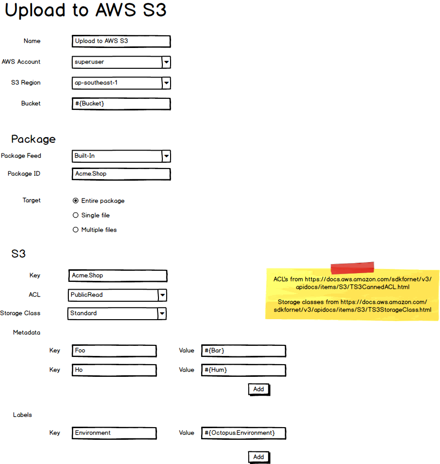
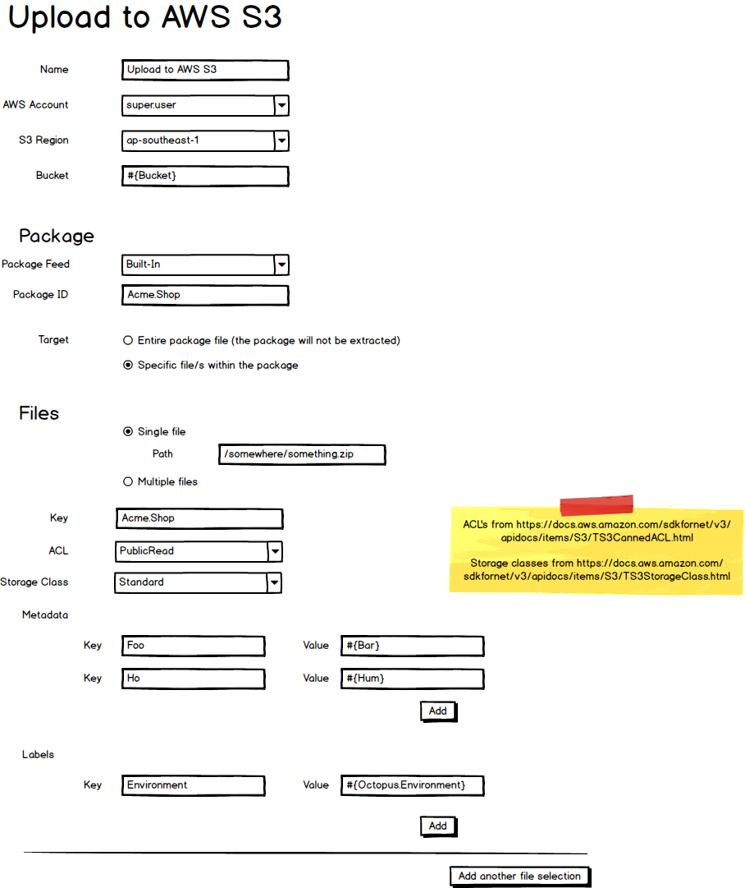
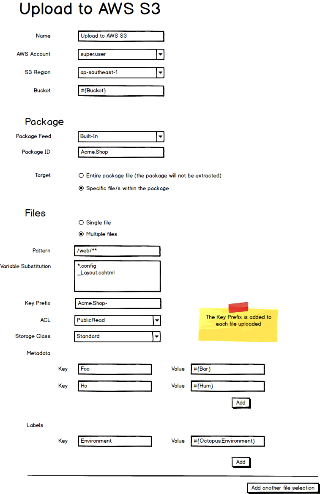

# Upload to S3 Step

Deploying applications to AWS generally involves uploading files to an S3 bucket.

There are a couple of options for this today, each with downsides:

- Use the community library [Amazon S3 Upload Step](https://library.octopusdeploy.com/step-templates/302e0653-e84e-4db6-be53-1ee1a56dea88/actiontemplate-amazon-s3-upload). The downside with this is that it requires the files to already be on disk.  Which requires running a _Deploy a Package_ step.  Which requires a Tentacle. Requiring a Tentacle to deploy to AWS is not ideal.  

- Script the upload to S3 yourself, and run the script from within a package (and set the step to _Run on Server_).  This will cause the package to be extracted on the Octopus Server (or a worker), and the files are then available to the script. The downsides here are first that you have to script it yourself, and second that this is not immediately obvious to a user not intimately familiar with Octopus. 

**tl;dr we need a built-in Upload to S3 step**

They are 3 ways you may wish to use this step:

## Upload the entire package to S3

## Upload a single file from a package

## Upload multiple files from a package 

