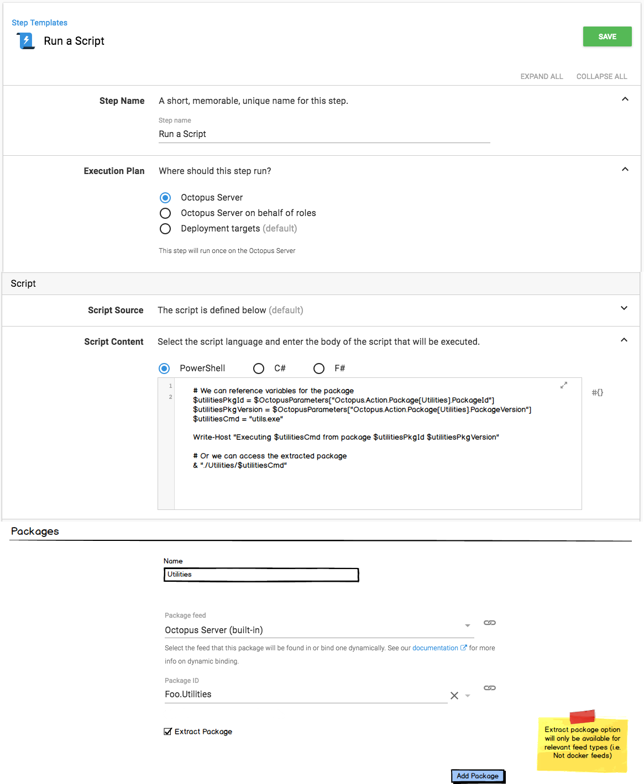

## Packages in Run a Script Step

It is not currently possibly to reference a package from a Run a Script step.  The script _can_ be sourced from a package, which as a side-effect gives the script access to the extracted contents of the package, but if you want to access a package (or it's contents) without embedding the script inside it then you're out of luck. 

There are various work-arounds for this.  A common one is to deploy the package, and then reference the deployed contents from a script-step.  The problem with this is:

- You need to deploy to a Tentacle\SSH server, when often you really just want a temporary work-space. 
- This isn't exactly intuitive.

And if the package you wish to use is a container-image, then you are really out of luck today. Because you can't embed a script inside the container (at least not currently), and the deploy-to-a-Tentacle work-around doesn't apply. 

### Proposal 

We will allow adding package references to _Run a Script_ steps.

The referenced packages will be assigned a name by the user (`Utilities` in the example above), which will serve as the index for the variables. e.g. `Octopus.Action.Package[Utilities].PackageId`.

If the user selects the `Extract Package` option, we will extract the package into a sub-directory of the script working directory, using the supplied name as the directory-name.  i.e. `{{WorkingDir}}/Utilities`.  We will first sanitize this name to ensure it is safe to use a directory, and make the value available at `Octopus.Action.Packages[Utilities].ExtractedDirectory` (or something like that).