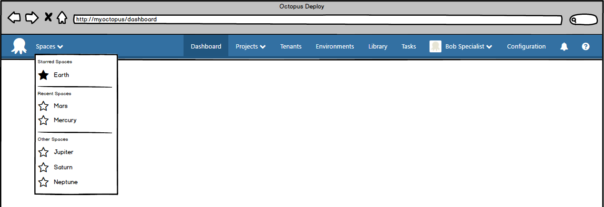

# Spaces

## The Problem

Octopus was original designed with small teams in mind. Everything is at the global level: Projects, Environments, Lifecycles, Variable-Sets, etc.

In large organizations, as more teams onboard, this doesn't scale well:

- People end up "namespacing" things to avoid conflicts and confusion: "This is our `Production` environment"
- People struggle to provide any segregation using our permission system. We introduced the ability to "scope" a Team to a certain Environment or Project, and later had to introduce Tenants and Project Groups into the mix.

## Spaces to the Rescue 

We will push almost everything down a level, into Spaces. Spaces serve to segregate an Octopus Server.      

The only things that will remain global are:

- Octopus Server Configuration (License, Maintenance Mode, HTTPS Certificate, etc)
- Users

This means that Spaces will contain:

- Projects
- Environments
- Lifecycles 
- Accounts
- Certificates
- Variable Sets
- Tenants (Tenant feature-toggle will be pushed down into Spaces)
- Step Templates

A couple of things will span between:
- Teams
- Roles   

Still to be decided:
- Built-in Package Repository (see below)

### Teams and Roles

The following is better understood if separate the concepts of a team from it's role-mappings.  So,

Team: A collection of users (possibly via AD groups).
Role-mappings: A team can be assigned roles at various scopes (more below).

Scopes (Environment, Project, Tenant, etc) are being removed from the team, and defined per role-mapping instead (See [permissions spec](../Permissions/Permissions-PlanB.md)).

Teams will exist at the global level.  This reflects two facts:
- There are global permissions that still need to be allocated 
- Some organizations may prefer to manage their teams at the global level 

But some organizations may also prefer to allow teams to be managed _within_ spaces (or a combination of global and per-space).

To cater for this, teams may be created at the global level or within a space.  Teams created within a space will be "scoped" to the space.  They will still be visible from the global level (though we may manage their visibility with a filter, for example), but will _not_ be visible from within other spaces. 

Similarly for roles, they will exist at the global level. When a user defines custom roles, they map optionally scope them to a space.

The scopes available for selection when applying a role-mapping for a team will be determined by the permissions within the role. For example, if the role contained `EnvironmentView` and `ProjectView` permissions, then environment and project (and project-group) scopes would be available for selection.

The space is effectively an additional scope.  When mapping roles which contain permissions eligible for scoping, a space scope may also be applied.
The UI should make it easy to edit role-mappings in the context of a space, so that rather than having to explicitly specify the space on each mapping, it would be implicit by the fact that you are "in" the space. 

If we do this right, this will allow users to choose whether to model teams at the global or space levels. The challenge will be making it clear in the UI whether which level a team is being created at, and expressing the relationship between role-mappings and teams.

Key Points:

- Teams conceptually are global, but can be created at either the global or space level.
- Teams created at the space level are scoped to that space.
- Conceptually (and possibly in our data-model), role-mappings should be considered separate to teams. Teams define the group of users, and they can be assigned roles at the global level and\or within one or more spaces.
- Roles conceptually are global, but can be scoped to a space, similar to teams.
- Space effectively functions as an additional scope on role-mappings.

### Built-in Package Repository

We have not yet decided whether this should exist at the Server level, or the Space level.

One common use-case for the built-in repository being global is that people will want to push a package once that is shared by multiple teams to the built-in feed without having to host their own nuget feed and configuring it in each space. 

On the other hand, some people will want to only see packages for their space, and not packages from other spaces.

External feeds will exist within each space, which will allow users to scope their packages however they want, regardless of whether the built-in feed is global or not.

### But surely _X_ has to be global

It is easy to imagine scenarios for almost all entities in which one may want them to be global. Not only does this quickly lead to the current situation, it would actually be worse because everything could live at multiple levels.

Our initial position is that everything above lives within a space.  If we (or our customers) can produce a very compelling reason why something should be global, we'll reconsider.

## Global

There are two "scopes" we have to consider in the UI: Space and Global

There are two ways we could deal with these different scopes.

1. In the space switcher, add a special option to represent "global" stuff. When you switch to the "global" option, you can't see any space-specific sections, and can only see the global sections. While you are in a space, you can't see any global sections.
2. Always show global options, even when you are in a space. Carefully segregate global sections from space-specific sections to avoid ambiguity.

We have decided to go with option 2 for now. We think it might be confusing that you need to do what feels like "changing your space" in order to access certain sections that are unrelated to spaces.

This might mean we need a new section, entitled something like `Administer` which contains server-level administration options. This is distinct from `Configure` which could contain space-specific options. In fact, `Configure` might not make sense at all (the distinction between `Administer` and `Configure` might be confusing to a user), so we could instead move the space-specific options out to different sections. For example, we could have a `Security` sections which deals with teams and roles, and a `Monitoring` section which deals with `Tasks` and `Audit`.

The `Task` and `Audit` log are a little tricky... when you are within a space, you want these screens to be filtered to a space. But you also might want to see "global" things on these screens as well. There are a few options here, but we have decided that we want to start with making this a "global" screen that has a space filter. This means you could be in `Space A`, navigate to the Audit log and filter it to `Space B`, without changing out of `Space A` in the space switcher.

## Migration

Everything existing would be moved into a default space.

Ideally, all API endpoints would work as they do today, against the default space.

For example, `/api/projects/all` would retrieve all projects in the default space (which would be everything initially).

After this, people would start making other spaces and moving things into those other spaces. We will provide some tooling to take a Project and all the things it needs into another space.

We might consider adding a feature to clone an entire space in future. This will allow people to move things into other spaces by cloning and deleting things from both the original and cloned spaces. This could be a cheaper feature that might act as a substitute for a richer "moving" feature, since a "moving" feature will need to traverse and move the dependencies of whatever you are moving.

## HTTP API

Space would become a component in our HTTP API paths for list operations. e.g.

`/api/{space}/projects/all`

For backwards compatibility we would infer the default space if one isn't specified in the path. e.g.

`/api/projects/all` would retrieve all projects in the default space.

Referencing individual entities should still require a space (unless it's the default space) since some resources (like projects) can be reference by name, which _may only be unique within a space?_

Once an instance has multiple spaces, it might be risky to continue using api routes that don't include a space, since you might inadvertently make changes to the wrong space. It may be safer to always explicitly specify the space. It might be useful to provide an option to users to disable the routes that infer the space if it is absent, which will cause those routes to return an error response if they are hit.

### Teams and Roles via the API

Although teams and roles span the bridge between global and space levels, they should be considered global for the purposes of the API. For example `/api/teams` should return all teams for the Octopus instance. These could possibly be filtered for a given space, e.g. `/api/teams?space={SpaceID}`, but this is different to the other routes described above.

 

## Database

Two ways you could change the database include:

1. Adding a `SpaceId` column to all relevant tables in the database (this will be almost all of the tables). It will be indexed so we would expect performance to be acceptable when you need to filter to a specific space (which will be almost all queries).
2. Put each space in its own database schema. Tables don't need a `SpaceId` column. This is similar to having a separate database per Space, without all the complications that come from creating new databases.

We decided that we would go with the first option (adding a `SpaceId` column) for now. One driving factor is that some users create un-privileged users for Octopus's database access that will not have the ability to create new database schemas. One downside of using a `SpaceId` column is that there is slightly more risk that we might leak data from another space if we have a bug in the way we form our queries, but we think we can manage this risk. We also think it is likely that in future we will need to be able to share things between spaces, and having a `SpaceId` column may give us more flexibility in how we approach this problem.

## UI

There will be a Space-Switcher in the header:

When a user has just upgraded, or has not created a space beyond the default space, spaces should be mostly invisible in the UI, in the same way that you can't see anything to do with tenants until you start using them.

Spaces will probably be a new top-level menu item (only visible if you have appropriate permissions). This gives you a place where you can administer spaces. It also gives us a place where we can show an onboarding dashboard.

We want to be consistent between the Tenants and Spaces features. Both of them affect a large part of the Octopus experience, and both of them are "hidden" for fresh installs. Instead of using a feature toggle to enable/disable the UI for these features, we should instead derive the visibility from whether or not the feature is being used. This means removing the `Multi-Tenancy` feature toggle, and instead showing multi-tenancy features if at least one tenant exists. We should have something in the UI to allow users to add new spaces/tenants if they aren't using the feature yet. This could be something like a greyed out `+ Tenants` button at the end of the main nav bar.

## Permissions 

Some changes to the Permissions model are required to support Spaces. 
[Two options](../Permissions/index.md) were considered. [Plan B](../Permissions/Permissions-PlanB.md) was decided on. 

## Targets

We considered allowing Targets to live at the Server level, and having them included in Environments within a Space. 

We decided that targets would be added to and belong to a Space. If the same physical target is used in multiple Spaces, then it will be represented by multiple targets in Octopus. 
