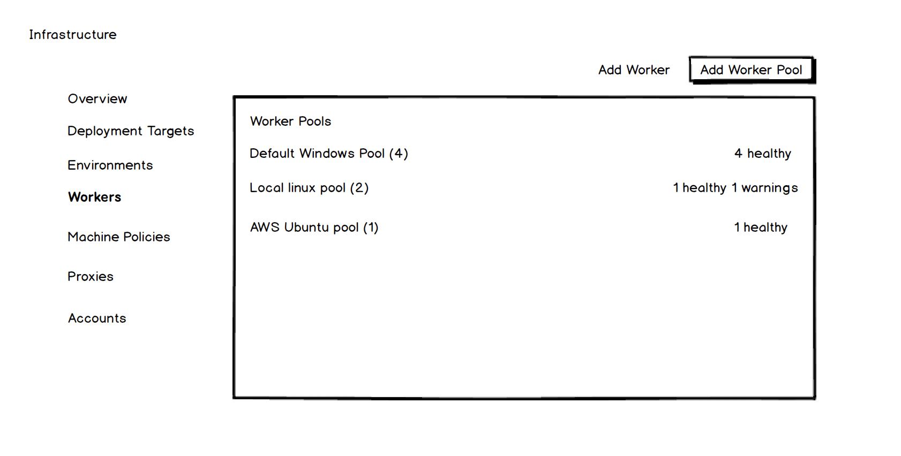

# Workers

## The Problem

Run-on-server steps (including, for example, script steps and Azure deployments) run on the Octopus server by invoking Calamari.

For script steps this means arbitrary code executing on the server.  Many administrators feel that they gave rights to users to deploy to machines, not to execute code on the Octopus server.  Octopus users are generally trusted in small teams, but as Octopus is increasingly used enterprise-wide, protection from mistakes and malicious scripts is required.

Run-on-server steps also add load to the server and it's not possible to load balance or scale these tasks.

Further, with all such steps running on the one machine, it's not easy to run a script once in a particular environment or off-load work to machines that have particular capabilities: e.g. run once on Linux, run once in this network segment or run once on a machine with library X.Y.Z.

## Run somewhere, I don't care where VS run on a machine in an environment

It is possible already to have, for example, a pet tentacle with a particular role and database/file-system access and a script step targeted at that role.  The step could, for example, set up a load balancer (needing to be a machine in the right network zone) or run a database script (needing to be run on a machine that can access the DB).

Steps, such as above, that are required to be run in the deployment environment should be able to target particular machines or pick any machine from a role in the deployment environment.  To further this we are altering the [Execution Plan options](https://github.com/OctopusDeploy/Issues/issues/4159).

The remainder of this document is about steps required to run somewhere, maybe on a machine of a particular type, but not in any environment.  For steps like:

* Run this Azure step somewhere
* Run this script, doesn't matter where
* This script needs to run on a Linux box somewhere
* This script does some heavy lifting, doesn't really matter where it runs, just don't hold up a deployment target

we are introducing workers and pools of workers.

## Workers and Worker Pools

Workers are machines (just like deployment targets) and invoke Calamari (just like deployment targets).

The infrastructure section will be expanded to add a card for workers.

and a tab for workers

Both similar to what's currently available for environments.

Workers are just machines, so machine policies, health checks and Calamari updates happen just like deployment targets.

The page for adding/editing a machine will allow assigning to a worker pool, similarly to how roles and environments are added.

Worker pools can be created globally or for a space.  Consequently, only server/space admins can create pools or assign machines to pools.

Admins can provision and remove workers as required.  For example, spinning up more workers in AWS for times when load is high and removing when load is low.  Adding options for Octopus auto provisioning workers on demand is not currently in scope.

## Running steps on workers

Steps that can currently run-on-server would be changed to allow picking a worker pool.  Execution of the step is selecting a worker from the pool and orchestrating the step.  See also new format for [Execution Plan](https://github.com/OctopusDeploy/Issues/issues/4159)

Steps that are currently restricted to only run on server, such as Azure steps, will be restricted to only run on a machine from a pool.

Detecting machine capabilities is out of scope.  Octopus will expect machines in the selected pool to have the required libraries.  If a step requires more than is bundled with Calamari it should be listed in the UI. A pool might also allow admins to attach some notes letting deployers know what to expect from machines in the pool.

## Defaults and Upgrades

By default, there will be a "Default Windows Pool" which will contain the octopus server.  Similarly, upgrading will create this pool and add the server to it.  So OOTB, and on upgrades, everything runs just as before workers.

An admin can then elect to add machines to pools and create new pools.

An admin that wants to remove the ability to run scripts on the Octopus server removes the server from the default pool.